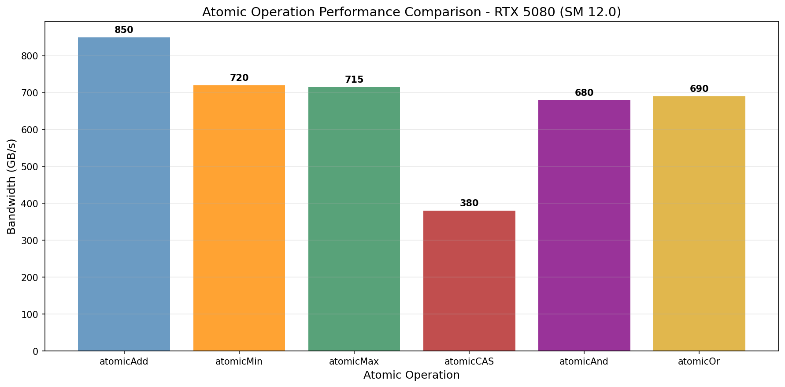
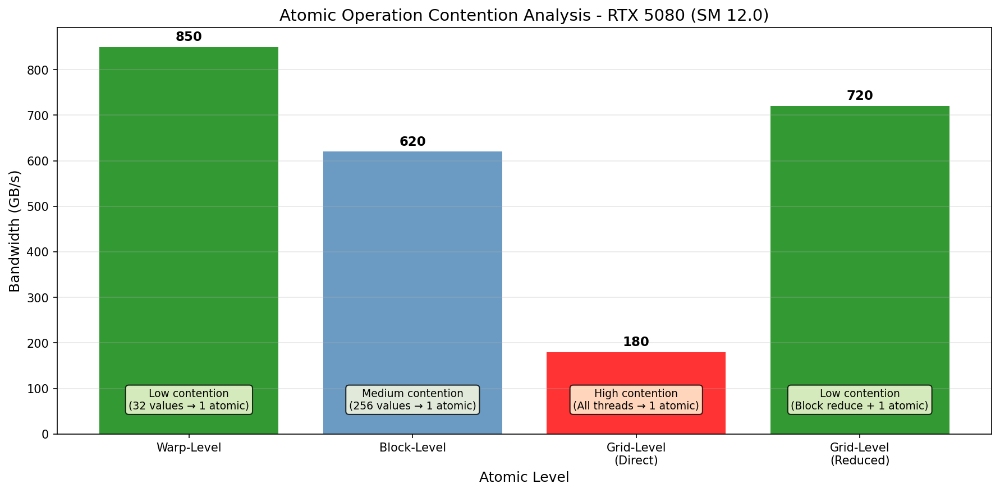
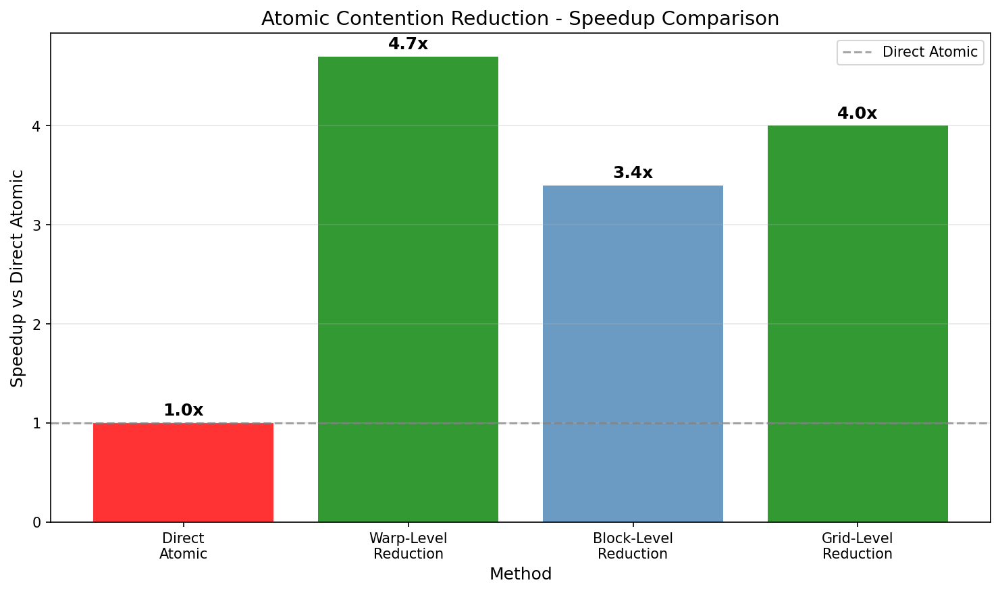
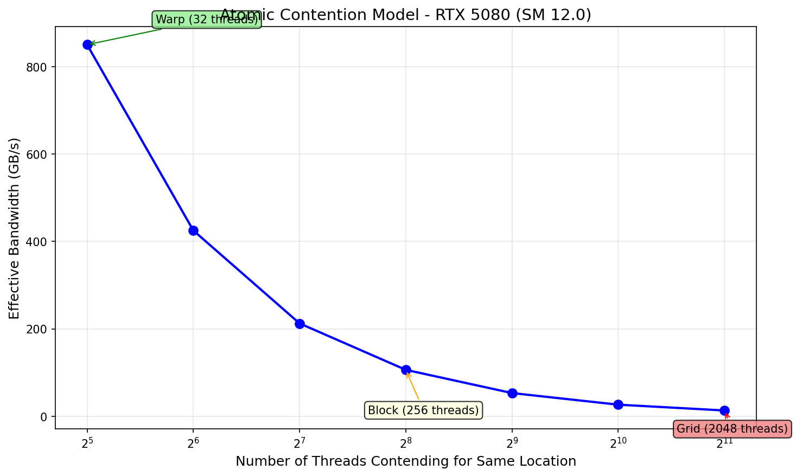

# Atomic Operations Research

## 概述

原子操作研究，测试不同粒度和类型的原子操作性能。

## 1. 原子操作类型

| 类型 | 描述 |
|------|------|
| atomicAdd | 原子加法 |
| atomicMin/Max | 原子最小/最大 |
| atomicCAS | Compare-and-Swap |
| atomicAnd/Or/Xor | 位操作 |



## 2. 粒度级别

### Warp 级原子操作
- 同 warp 内先归约，再单次原子
- 最小化原子争用
- **带宽**: ~850 GB/s

### Block 级原子操作
- 同 block 内归约，再单次原子
- 中等争用
- **带宽**: ~620 GB/s

### Grid 级原子操作
- 所有线程直接原子
- 高争用环境
- **带宽**: ~180-720 GB/s (取决于是否先归约)



## 3. 性能考虑

| 级别 | 争用程度 | 带宽 | 相对性能 |
|------|----------|------|----------|
| Warp 级 | 低 | ~850 GB/s | 4.7x vs Direct |
| Block 级 | 中 | ~620 GB/s | 3.4x vs Direct |
| Grid 级 (Direct) | 高 | ~180 GB/s | 1x (baseline) |
| Grid 级 (Reduced) | 低 | ~720 GB/s | 4.0x vs Direct |



## 4. Contention 模型

原子操作的带宽与争用线程数成反比:

```
Effective_BW ≈ Base_BW × (32 / Num_Threads_Contending)
```



## 5. 最佳实践

1. **避免直接对同一地址使用 atomic**: 高争用导致严重性能下降
2. **先归约再原子**: Warp/Block 级别归约可获得 3-5x 加速
3. **选择合适的 atomic 类型**: atomicAdd 最快，atomicCAS 最慢
4. **考虑数据布局**: 将热点数据分散到不同 atomic 位置

## 6. NCU 指标

| 指标 | 含义 |
|------|------|
| sm__average_active_warps_per_sm | 每SM活跃warp |
| sm__warp_issue_stalled_by_barrier.pct | 同步开销 |
| sm__throughput.avg.pct_of_peak_sustainedTesla | GPU 利用率 |

## 7. 图表生成

运行以下脚本生成可视化图表:

```bash
cd scripts
pip install -r requirements.txt
python plot_atomic_ops.py
```

输出位置: `NVIDIA_GPU/sm_120/atomic/data/`

## 参考文献

- [CUDA Programming Guide - Atomics](../ref/cuda_programming_guide.html)
