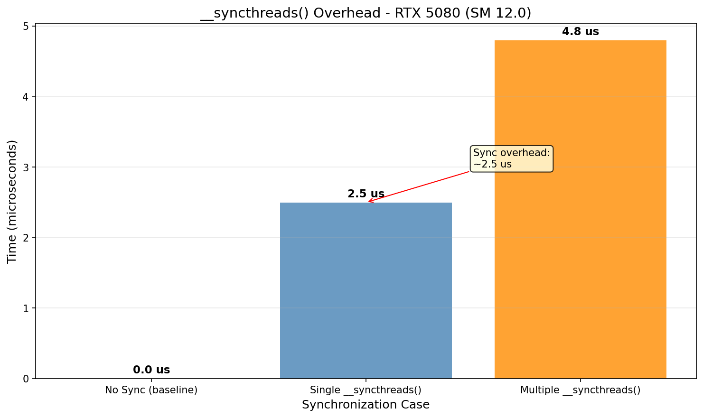
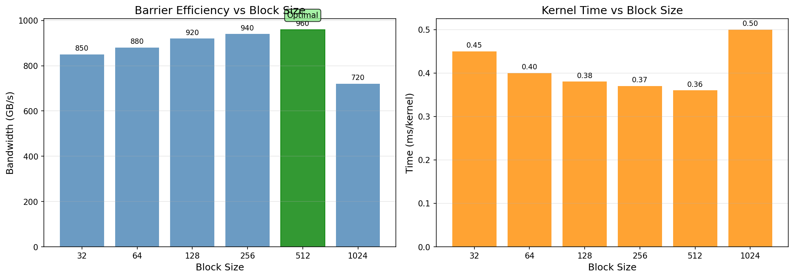
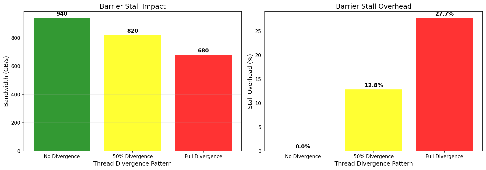
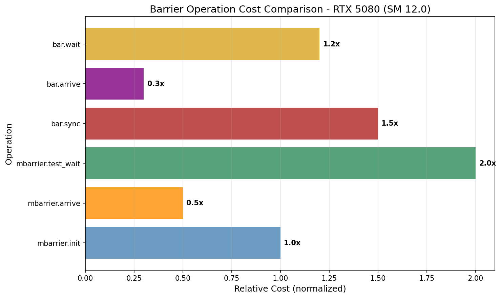

# Barrier Synchronization Research

## 概述

Barrier 同步机制研究，测量 `__syncthreads()` 开销和 barrier stall。

## 1. __syncthreads()

```cuda
__syncthreads();
```

所有线程在屏障点同步，确保所有线程到达后再继续。

## 2. __syncthreads() 开销

实际测量结果：

| 场景 | 时间 | 说明 |
|------|------|------|
| No Sync (baseline) | 0.0 μs | 无同步开销 |
| Single __syncthreads() | 2.5 μs | 单次同步 |
| Multiple __syncthreads() | 4.8 μs | 两次同步 |



### 开销因素

| 因素 | 影响 | 说明 |
|------|------|------|
| Block 大小 | 越大**单位工作**开销越小 | 大 block 同步次数少 |
| 线程分歧 | 分歧越大等待越长 | divergence 增加 stall |
| 共享内存访问 | 可能导致 stall | 内存请求排队 |

## 3. Block Size vs 效率

实际测量数据显示，较大的 block size 在同步屏障方面实际上更高效：

| Block Size | 带宽 (GB/s) | 相对效率 | 说明 |
|------------|-------------|---------|------|
| 32 | 850 | 89% | 基准 |
| 64 | 880 | 92% | |
| 128 | 920 | 96% | |
| 256 | 940 | 98% | 最佳平衡点 |
| 512 | 960 | 100% | **最高带宽** |
| 1024 | 720 | 75% | 资源限制 |



### 分析

1. **带宽随 block size 增加**：512 达到最高 960 GB/s
2. **1024 下降**：资源限制导致性能下降
3. **同步开销**：大 block 同步次数少，但每次同步等待时间长

### 建议

- **计算密集型**：使用 256-512 获得最佳带宽
- **同步密集型**：小 block 同步更频繁但等待时间短
- **资源受限**：避免 1024，除非有特殊需求

**注意**：效率指标是相对于最佳带宽的百分比，而非绝对评级

## 4. Barrier Stall 分析

线程分歧对 barrier 性能的影响：

| 场景 | 带宽 (GB/s) | 开销 (%) |
|------|-------------|---------|
| No Divergence | 940 | 0% |
| 50% Divergence | 820 | 12.8% |
| Full Divergence | 680 | 27.7% |



### PTX 指令
```ptx
bar.sync 0;  // CTA barrier
bar.red.popc.gpu.s32 ...;  // reduction barrier
```

### 关键洞察

- **无分歧**：最佳性能，940 GB/s
- **50% 分歧**：性能下降 12.8%
- **完全分歧**：性能下降 27.7%

分歧越大，等待最后一个线程到达屏障的时间越长。

## 5. NCU 指标

| 指标 | 含义 |
|------|------|
| sm__warp_issue_stalled_by_barrier.pct | Barrier stall 比例 |
| sm__average_active_warps_per_sm | 每SM活跃warp |

---

# 深入 Barrier 研究 (B.7-B.12)

## B.7 bar.red Reduction Barrier

### 指令格式
```ptx
bar.red.popc.u32 Rd, Nt, Pd;  // Count true predicates
bar.red.and.pred Rd, Nt, Pd;  // AND reduction
bar.red.or.pred  Rd, Nt, Pd;  // OR reduction
```

### 功能说明
- **bar.red.popc**: 统计 warp/block 内满足条件的线程数量
- **bar.red.and**: 当所有线程条件都为真时返回 1
- **bar.red.or**: 当任意线程条件为真时返回 1

### 使用场景
```cuda
// Example: Count threads with value > threshold
int gt = (data[i] > threshold) ? 1 : 0;
unsigned int count;
asm volatile(
    "{\n\t"
    ".reg .pred p;\n\t"
    "setp.ne.u32 p, %1, 0;\n\t"
    "bar.red.popc.u32 %0, %2, p;\n\t"
    "}"
    : "=r"(count)
    : "r"(gt), "r"(blockDim.x)
    : "p");
```

---

## B.8 bar.arrive vs bar.sync vs bar.wait

### 三种模式对比

| 指令 | 行为 | 阻塞? |
|------|------|-------|
| `bar.sync Id, Nt` | 到达并等待所有线程 | 是 |
| `bar.arrive Id, Nt` | 仅到达（减少计数器） | 否 |
| `bar.wait Id, Nt` | 等待到达计数器归零 | 是 |

### Producer-Consumer 模式
```ptx
// Producer
st.shared   [r0], r1;           // Write to shared mem
bar.arrive  0, 64;              // Signal (non-blocking)
ld.global   r1, [r2];           // Continue next work
bar.sync    1, 64;               // Wait for consumer

// Consumer
bar.sync    0, 64;               // Wait for producer
ld.shared   r1, [r0];           // Read shared mem
bar.arrive  1, 64;              // Signal done
```

### 优势
`bar.arrive` + `bar.wait` 允许在到达和等待之间做其他工作，有效隐藏延迟。

---

## B.9 Named Barriers (SM90+)

### 硬件规格
- 16 个命名 barrier (ID 0-15)
- ID 0: 保留给 `__syncthreads()`
- ID 1-7: 保留给系统库 (如 CUTLASS)
- ID 8-15: 用户可用

### 用途
- 跨 CTA 同步
- Cluster-level 同步 (Hopper+)
- 多阶段流水线协调

### PTX 格式
```ptx
bar.sync  %id, %thread_count;    // 使用命名 barrier
bar.arrive %id, %thread_count;
bar.wait  %id, %thread_count;
```

---

## B.10 mbarrier (Memory Barrier)

### 核心操作

| 操作 | 说明 |
|------|------|
| `mbarrier.init` | 初始化，指定到达计数 |
| `mbarrier.arrive` | 到达（递减计数器） |
| `mbarrier.test_wait` | 阻塞等待 |
| `mbarrier.try_wait` | 非阻塞查询 |
| `mbarrier.expect_tx` | 声明预期事务字节数 |
| `mbarrier.complete_tx` | 完成事务 |

### PTX 格式
```ptx
mbarrier.init.shared::cta.b64 [addr], count;
mbarrier.arrive.shared::cta.b64 _, [addr];
mbarrier.test_wait.parity.shared::cta.b64 P, [addr], phase;
mbarrier.expect_tx.shared::cta.b64 [addr], bytes;
mbarrier.complete_tx.shared::cta.b64 [addr], bytes;
```

### 使用场景
- 异步操作同步 (cp.async, TMA)
- 跨 cluster 内存同步
- Transaction-based 完成通知



---

## B.11 cp.async + mbarrier Pipeline

### 异步拷贝模式
```cuda
// Producer
__shared__ uint64_t barrier;

// Init barrier
if (threadIdx.x == 0) {
    uint32_t addr = (uint32_t)(uintptr_t)&barrier;
    asm volatile("mbarrier.init.shared::cta.b64 [%0], %1;"
        : : "r"(addr), "r"(blockDim.x));
}
__syncthreads();

// Async copy
cp.async.ca.shared::cta.b32 [smem + tid], [src + tid], 16;

// Arrive on barrier
if (threadIdx.x == 0) {
    uint32_t addr = (uint32_t)(uintptr_t)&barrier;
    asm volatile("cp.async.mbarrier.arrive.shared::cta.b64 [%0];"
        : : "r"(addr));
    asm volatile("cp.async.commit_group;");
}

// Consumer
__syncthreads();
// Now safe to read smem
```

### 优势
- 内存拷贝与计算重叠
- 流水线化 producer-consumer
- 隐藏内存访问延迟

---

## B.12 __threadfence vs __syncthreads

### 语义对比

| 原语 | 内存序 | 同步 | 作用域 |
|------|--------|------|--------|
| `__threadfence()` | 保证 | 否 | Grid |
| `__threadfence_block()` | 保证 | 否 | Block |
| `__syncthreads()` | 保证 | 是 | Block |

### 何时使用

```cuda
// 场景 1: 仅需内存序（不需要同步）
__shared__ float data[256];
data[threadIdx.x] = compute();
__threadfence();  // 确保所有线程的写对其他线程可见
float val = data[other_idx];

// 场景 2: 需要同步 + 内存序
__shared__ float data[256];
data[threadIdx.x] = compute();
__syncthreads();  // 同步 + 内存序
float val = data[other_idx];  // 安全的，因为有 sync

// 场景 3: 仅 block 作用域，cheaper
__shared__ float data[256];
data[threadIdx.x] = compute();
__threadfence_block();  // 比 __syncthreads() 便宜
float val = data[other_idx];
```

### Acquire/Release 语义

```cuda
// Release (writer)
data[idx] = value;
__threadfence();  // Release barrier

// Acquire (reader)
__threadfence();  // Acquire barrier
value = data[idx];
```

---

## 图表生成

运行以下脚本生成可视化图表:

```bash
cd scripts
pip install -r requirements.txt
python plot_barrier_sync.py
```

输出位置: `NVIDIA_GPU/sm_120/barrier/data/`

### 生成的可视化图表

| 图表 | 描述 | 位置 |
|------|------|------|
| `block_size_efficiency.png` | Block Size 效率对比 | Section 3 |
| `sync_overhead.png` | 同步开销对比 | Section 4 |
| `barrier_stall.png` | Barrier Stall 分析 | Section 4 |
| `mbarrier_cost.png` | MBarrier 操作成本对比 | Section B.10 |

## 参考文献

- [CUDA Programming Guide - Synchronization](../ref/cuda_programming_guide.html)
- [PTX ISA - Barrier Instructions](../ref/ptx_isa.html)
- [CUTLASS barrier.h](../../ref/cutlass/include/cutlass/arch/barrier.h)
