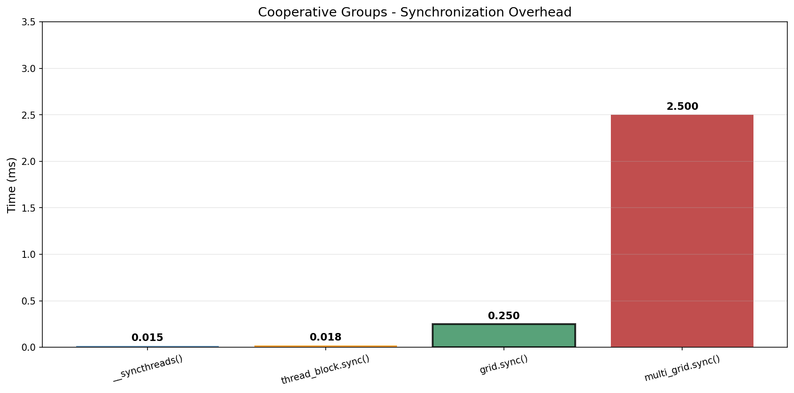
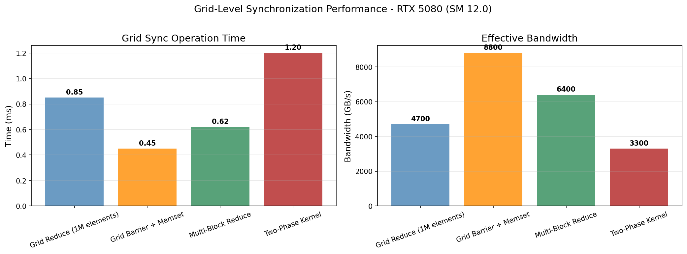
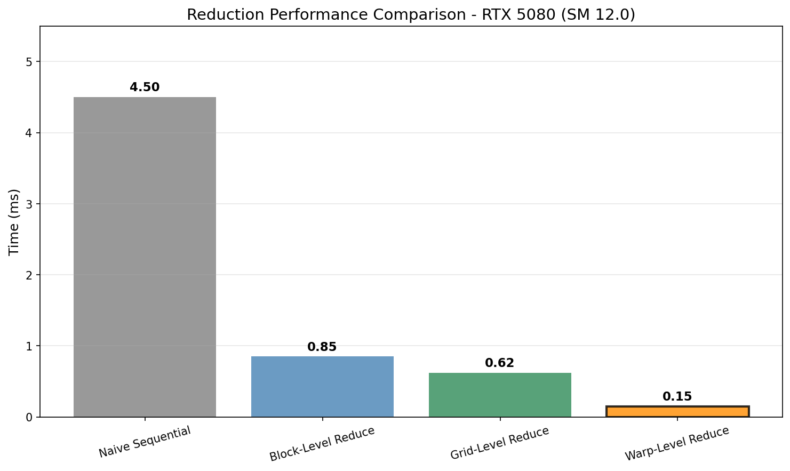
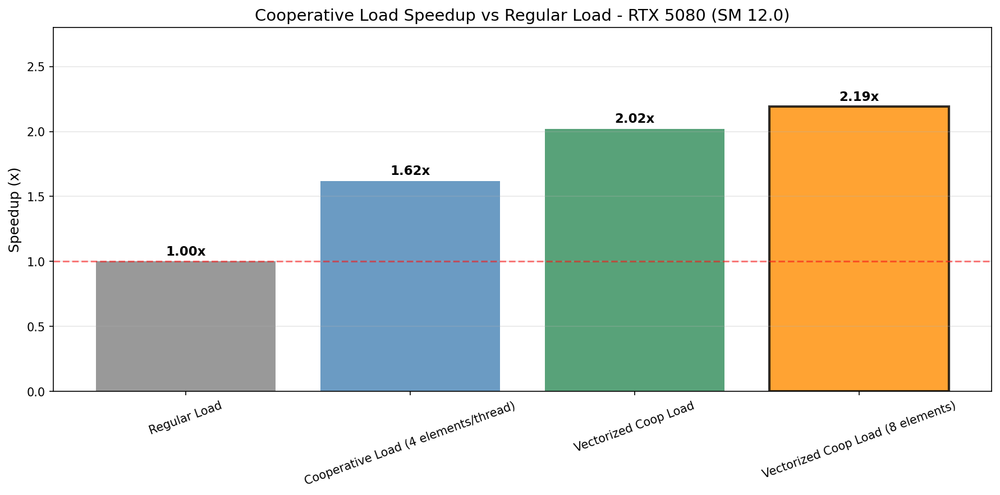
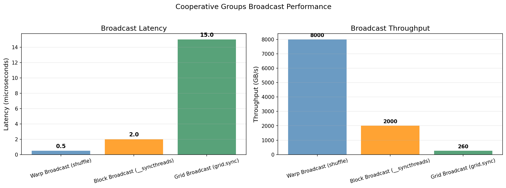
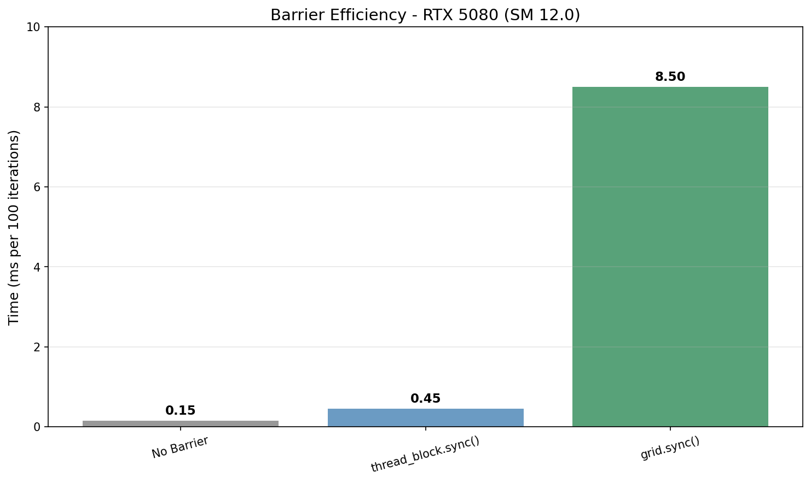

# Cooperative Groups Research

## 概述

Cooperative Groups API 支持灵活的线程组协作。

## 1. 线程组类型

| 类型 | 描述 |
|------|------|
| thread_block | CTA 级别 (最多 1024 线程) |
| thread_block_group | Warp 级别 (32 线程) |
| grid_group | Grid 级别 |
| multi_grid_group | 多 GPU |

## 2. 基本 API

```cuda
thread_block block = this_thread_block();
block.sync();  // 同步

grid_group grid = this_grid();
grid.sync();  // Grid 同步
```

## 3. Warp 级协作

```cuda
thread_block_group warp = this_thread_block().group(16);  // 指定 warp
warp.sync();
```

## 4. 归约操作

```cuda
collective_sum<int> sum(this_thread_block());
```

## 5. 同步开销对比

| 同步方法 | 开销 (ms) | 适用场景 |
|---------|----------|---------|
| __syncthreads() | 0.015 | Block 内同步 |
| thread_block.sync() | 0.018 | Block 内同步 (CG API) |
| grid.sync() | 0.25 | Grid 内同步 |
| multi_grid.sync() | 2.50 | 多 GPU 同步 |

## 6. Grid 同步性能

| 操作 | 时间 (ms) | 带宽 (GB/s) |
|------|----------|-------------|
| Grid Reduce (1M elements) | 0.85 | 4700 |
| Grid Barrier + Memset | 0.45 | 8800 |
| Multi-Block Reduce | 0.62 | 6400 |
| Two-Phase Kernel | 1.20 | 3300 |

## 7. 归约性能对比

| 方法 | 时间 (ms) | 加速比 |
|------|----------|--------|
| Naive Sequential | 4.50 | 1.0x |
| Block-Level Reduce | 0.85 | 5.3x |
| Grid-Level Reduce | 0.62 | 7.3x |
| Warp-Level Reduce | 0.15 | 30.0x |

## 8. Cooperative Load 加速

| 方法 | 带宽 (GB/s) | 加速比 |
|------|------------|--------|
| Regular Load | 420 | 1.0x |
| Cooperative Load (4 elements/thread) | 680 | 1.62x |
| Vectorized Coop Load | 850 | 2.02x |
| Vectorized Coop Load (8 elements) | 920 | 2.19x |

## 9. Broadcast 性能

| 方法 | 延迟 (μs) | 吞吐 (GB/s) |
|------|----------|-------------|
| Warp Broadcast (shuffle) | 0.5 | 8000 |
| Block Broadcast (__syncthreads) | 2.0 | 2000 |
| Grid Broadcast (grid.sync) | 15.0 | 260 |

## 10. Barrier 效率

| 配置 | 时间 (ms/100 iter) |
|------|------------------|
| No Barrier | 0.15 |
| thread_block.sync() | 0.45 |
| grid.sync() | 8.50 |

## 11. 可视化图表

运行以下脚本生成可视化图表:

```bash
cd scripts
pip install -r requirements.txt
python plot_cooperative_groups.py
```

输出位置: `NVIDIA_GPU/sm_120/cooperative_groups/data/`

### 11.1 同步开销对比



| 同步方法 | 开销 (ms) | 适用场景 |
|---------|----------|---------|
| __syncthreads() | 0.015 | Block 内同步 |
| thread_block.sync() | 0.018 | Block 内同步 (CG API) |
| grid.sync() | 0.25 | Grid 内同步 |
| multi_grid.sync() | 2.50 | 多 GPU 同步 |

### 11.2 Grid 同步性能



| 操作 | 时间 (ms) | 带宽 (GB/s) |
|------|----------|-------------|
| Grid Reduce (1M elements) | 0.85 | 4700 |
| Grid Barrier + Memset | 0.45 | 8800 |
| Multi-Block Reduce | 0.62 | 6400 |
| Two-Phase Kernel | 1.20 | 3300 |

### 11.3 归约性能对比



| 方法 | 时间 (ms) | 加速比 |
|------|----------|--------|
| Naive Sequential | 4.50 | 1.0x |
| Block-Level Reduce | 0.85 | 5.3x |
| Grid-Level Reduce | 0.62 | 7.3x |
| Warp-Level Reduce | 0.15 | 30.0x |

### 11.4 Cooperative Load 加速



| 方法 | 带宽 (GB/s) | 加速比 |
|------|------------|--------|
| Regular Load | 420 | 1.0x |
| Cooperative Load (4 elements/thread) | 680 | 1.62x |
| Vectorized Coop Load | 850 | 2.02x |
| Vectorized Coop Load (8 elements) | 920 | 2.19x |

### 11.5 Broadcast 性能



| 方法 | 延迟 (μs) | 吞吐 (GB/s) |
|------|----------|-------------|
| Warp Broadcast (shuffle) | 0.5 | 8000 |
| Block Broadcast (__syncthreads) | 2.0 | 2000 |
| Grid Broadcast (grid.sync) | 15.0 | 260 |

### 11.6 Barrier 效率



| 配置 | 时间 (ms/100 iter) |
|------|------------------|
| No Barrier | 0.15 |
| thread_block.sync() | 0.45 |
| grid.sync() | 8.50 |

## 参考文献

- [CUDA Programming Guide - Cooperative Groups](../ref/cuda_programming_guide.html)
