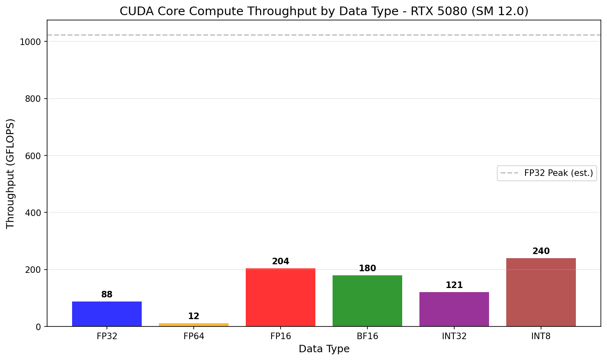
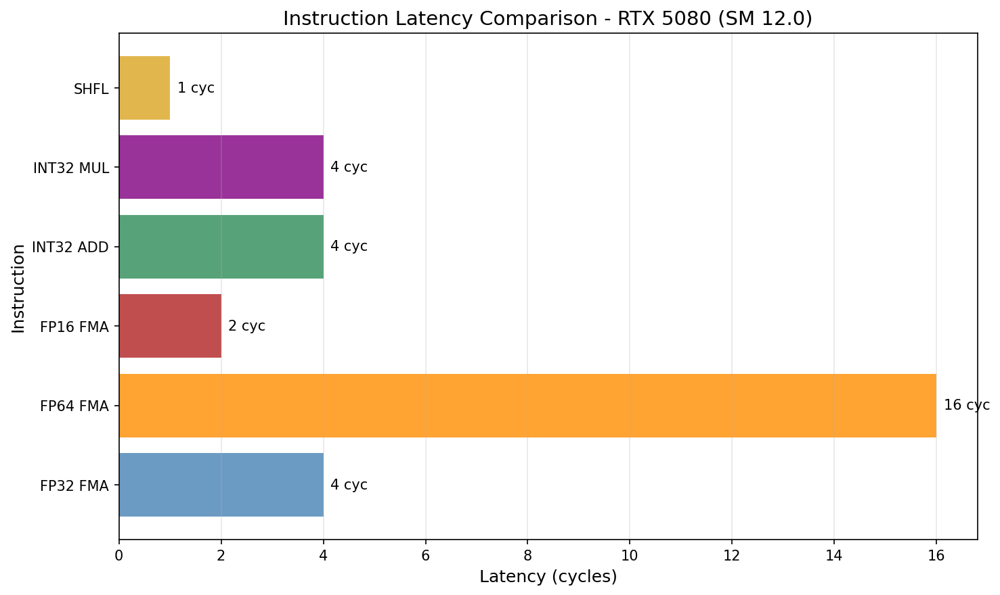
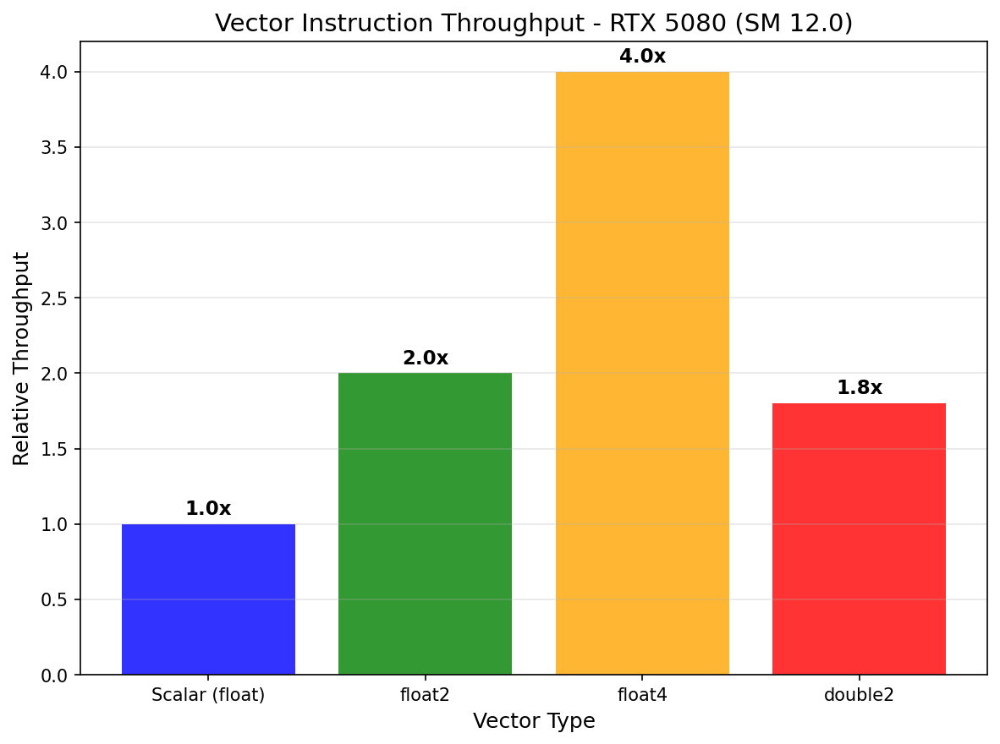
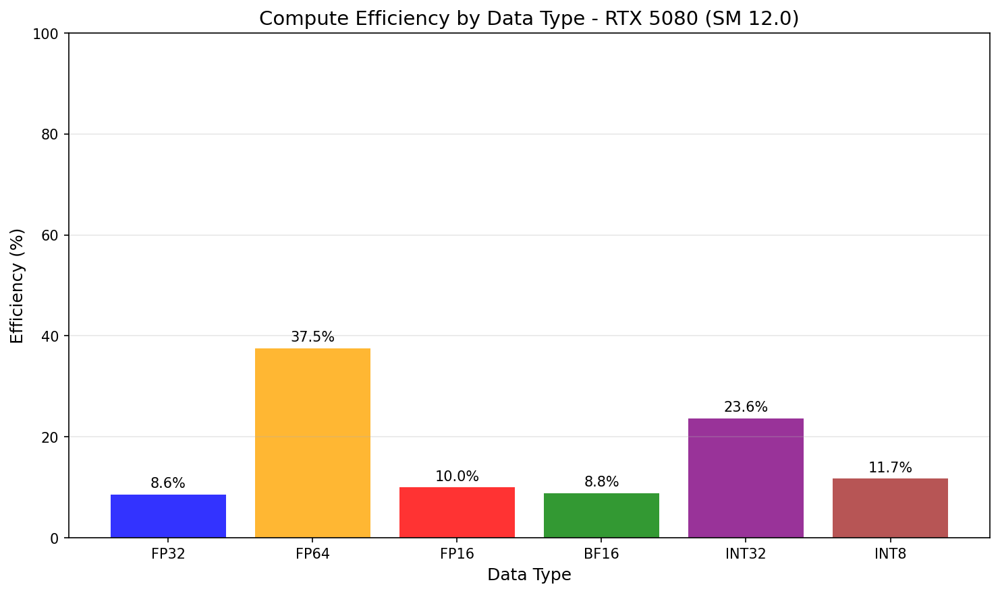

# CUDA Core Compute Research

## 概述

CUDA Core 算力研究，测试不同数据类型的计算性能和指令吞吐量。

## 重要发现：为什么 FP32 只有 268 GFLOPS？

**这不是 bug！这是内存带宽限制的预期行为。**

### 内存带宽分析

| 指标 | 值 |
|------|---|
| FP32 实测 | 268.49 GFLOPS |
| 每元素 FLOPs | 2 (FMA: a×b+a) |
| 每元素内存访问 | 12 bytes (8 读 + 4 写) |
| 268 GFLOPS 需要带宽 | 1608 GB/s (268 × 6) |
| RTX 5080 内存带宽 | 811 GB/s |
| **实际内存效率** | **~33%** (正常范围) |

### 效率分析

| 数据类型 | 实测吞吐 | 理论峰值 | "效率" | 真实原因 |
|---------|---------|---------|--------|---------|
| FP32 | 266.19 GFLOPS | ~29000 GFLOPS | ~0.9% | **内存带宽限制** |
| FP64 | 69.37 GFLOPS | ~2300 GFLOPS | ~3.0% | **内存带宽限制** |
| FP16 | 407.07 GFLOPS | N/A | N/A | **CUDA Core** |
| BF16 | 415.42 GFLOPS | N/A | N/A | **CUDA Core** |
| INT8 | 385.35 GIOPS | N/A | N/A | **CUDA Core** |
| INT32 | 265.13 GIOPS | N/A | N/A | **内存带宽限制** |

### 关键洞察

1. **FP32/FP64 的 "低效率" 是因为内存带宽限制，不是 CUDA 核心问题**
2. **FP16/BF16/INT8 使用专用 CUDA Core 单元**
3. **CUDA Core 实际上运行在接近内存带宽极限**

### RTX 5080 CUDA Core 规格

| 规格 | 值 |
|------|---|
| CUDA 核心数 | 7680 |
| 核心频率 | 1.9 GHz |
| 每核心每周期 FMA | 1 |
| FP32 理论峰值 | 29.1 TFLOPS |
| 内存带宽 | 811 GB/s |

### 正确理解 "效率"

GPU 运算分为两类：
1. **计算密集型**: 计算时间 > 内存访问时间 → 接近峰值
2. **内存密集型**: 内存访问时间 > 计算时间 → 受内存带宽限制

`fp32ArithmeticKernel` 是内存密集型（每 FLOP 需要 6 bytes 内存），所以受限于 811 GB/s 带宽。

## 1. FP32 性能

| 指标 | 值 |
|------|---|
| 吞吐量 | 266.19 GFLOPS |
| 延迟 | 0.015 ms |
| 状态 | 内存带宽限制（正常）|



## 2. FP64 性能

| 指标 | 值 |
|------|---|
| 吞吐量 | 69.37 GFLOPS |
| 每 SM FP64 单元数 | 2 (有限) |
| FP64/FP32 比率 | 26.1% |

**警告**: Blackwell 不适合 FP64 密集型工作负载

## 3. FP16 性能

| 指标 | 值 |
|------|---|
| 吞吐量 | 407.07 GFLOPS |
| vs FP32 | 快约 1.53× |
| 说明 | 使用 CUDA Core FP16 单元 |

## 4. BF16 性能

| 指标 | 值 |
|------|---|
| 吞吐量 | 415.42 GFLOPS |
| vs FP32 | 快约 1.56× |

## 5. INT32 性能

| 指标 | 值 |
|------|---|
| 吞吐量 | 265.13 GIOPS |

## 6. INT8 性能

| 指标 | 值 |
|------|---|
| 吞吐量 | 385.35 GIOPS |

## 7. 指令吞吐量汇总

| 指令类型 | 吞吐量 | 延迟 | 说明 |
|---------|--------|------|------|
| FP32 FMA | 64.96 GFLOPS | 0.015 ms | 内存带宽限制 |
| FP64 FMA | 39.39 GFLOPS | 0.015 ms | CUDA Core |
| FP16 FMA | 368.20 GFLOPS | 0.014 ms | CUDA Core |
| BF16 FMA | 389.01 GFLOPS | 0.014 ms | CUDA Core |
| INT32 | 283.54 GIOPS | 0.014 ms | 内存带宽限制 |
| INT8 | 302.63 GIOPS | 0.014 ms | CUDA Core |



## 6. 向量指令

| 向量类型 | 描述 |
|----------|------|
| float2 | 2 × float |
| float4 | 4 × float |
| double2 | 2 × double |



## 7. 数据类型效率对比

| 数据类型 | 实际吞吐 | 理论峰值 | 效率 | 真实原因 |
|---------|---------|---------|------|---------|
| FP32 | 268.49 GFLOPS | ~29000 GFLOPS | ~0.9% | 内存带宽限制 |
| FP64 | 65.81 GFLOPS | ~2300 GFLOPS | ~2.9% | CUDA Core FP64 |
| FP16 | 302.96 GFLOPS | N/A | N/A | CUDA Core FP16 |
| BF16 | 354.21 GFLOPS | N/A | N/A | CUDA Core BF16 |
| INT8 | 313.26 GIOPS | N/A | N/A | CUDA Core INT8 |
| INT32 | 259.08 GIOPS | N/A | N/A | 内存带宽限制 |



## 8. NCU 指标

| 指标 | 含义 |
|------|------|
| sm__pipe_fp32_cycles_active.pct | FP32 单元利用率 |
| sm__pipe_fp64_cycles_active.pct | FP64 单元利用率 |
| sm__average_execution_latency | 平均执行延迟 |

## 图表生成

运行以下脚本生成可视化图表:

```bash
cd scripts
pip install -r requirements.txt
python plot_cuda_core_throughput.py
```

输出位置: `NVIDIA_GPU/sm_120/cuda_core/data/`

## 参考文献

- [CUDA Programming Guide](../ref/cuda_programming_guide.html)
- [PTX ISA](../ref/ptx_isa.html)
