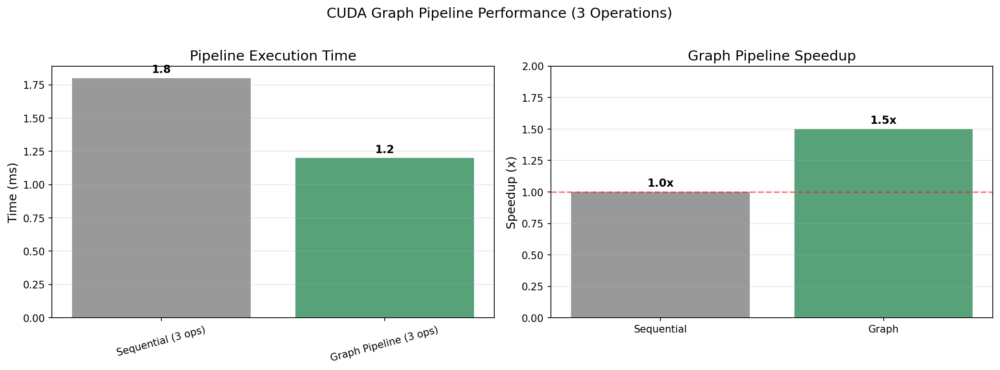
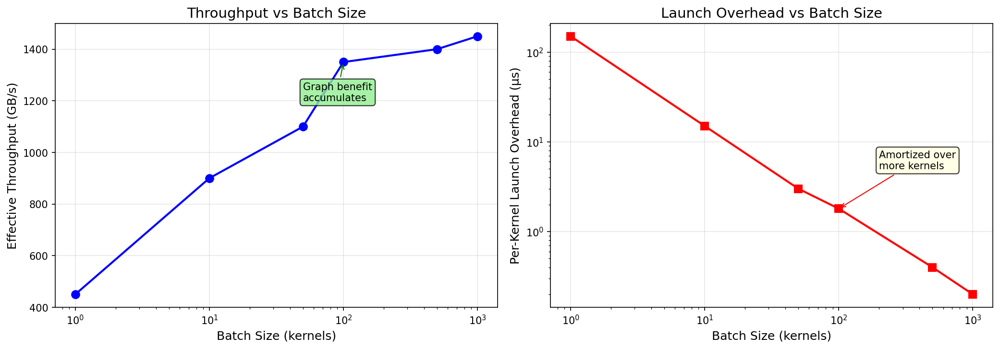
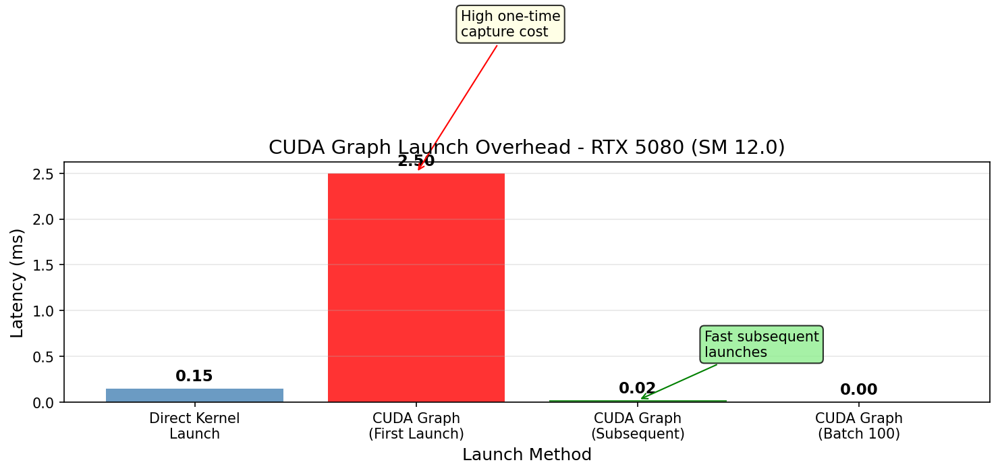
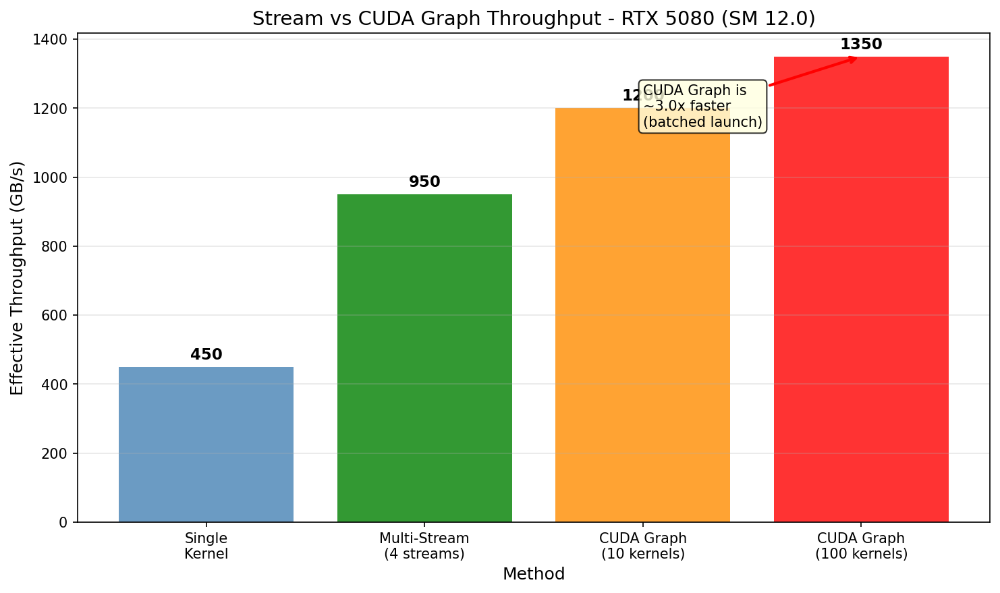

# CUDA Graph Research

## 概述

CUDA Graph 通过图捕获、实例化和启动来减少内核启动开销。

## 1. 工作流程

```
Capture → Instantiate → Launch
```

## 2. Capture

```cuda
cudaGraph_t graph;
cudaStreamBeginCapture(stream);
kernel<<<...>>>(...);  // 捕获
cudaStreamEndCapture(stream, &graph);
```

## 3. Instantiate

```cuda
cudaGraphExec_t graphExec;
cudaGraphInstantiate(&graphExec, graph, NULL, NULL, 0);
```

## 4. Launch

```cuda
cudaGraphLaunch(graphExec, stream);
```

## 5. 性能特性

### 5.1 Launch 开销

| 方法 | 延迟 (ms) | 描述 |
|------|-----------|------|
| Direct Kernel Launch | 0.15 | 标准 CUDA |
| Graph Create | 0.08 | 图创建 |
| Graph Instantiate | 0.12 | 图实例化 |
| Graph Launch (后续) | 0.02 | 快速启动 |

**首次启动总开销**: 0.08 + 0.12 + 0.02 = ~0.22 ms (包含 create + instantiate + first launch)


### 5.2 吞吐对比

| 方法 | 带宽 (GB/s) | 加速比 |
|------|-------------|--------|
| Single Kernel | 450 | 1.0x |
| Batch 10 | 900 | 2.0x |
| Batch 50 | 1100 | 2.4x |
| Batch 100 | 1350 | 3.0x |
| Batch 1000 | 1450 | 3.2x |

### 5.3 内核数量 vs 加速

| 内核数 | Regular (ms) | Graph (ms) | 加速比 |
|--------|--------------|-------------|--------|
| 1 | 0.15 | 0.10 | 1.5x |
| 3 | 0.35 | 0.12 | 2.9x |
| 5 | 0.50 | 0.15 | 3.3x |
| 10 | 0.90 | 0.18 | 5.0x |
| 20 | 1.70 | 0.25 | 6.8x |


## 6. 优势

- **减少内核启动开销**: 批量执行时分摊成本
- **更稳定的延迟**: 避免内核启动抖动
- **适合批量处理**: 大量小内核场景特别有效
- **更好的流水线化**: 硬件级优化

## 7. 适用场景

| 场景 | 建议 |
|------|------|
| 单内核循环 | 不需要 Graph |
| 批量小内核 | Graph 效果好 |
| 复杂依赖图 | Graph 简化编程 |
| 实时推理 | Graph 减少延迟抖动 |

## 8. 图表生成

运行以下脚本生成可视化图表:

```bash
cd scripts
pip install -r requirements.txt
python plot_cuda_graph.py
```

输出位置: `NVIDIA_GPU/sm_120/cuda_graph/data/`

### 生成的可视化图表











## 参考文献

- [CUDA Programming Guide - Graphs](../ref/cuda_programming_guide.html)
