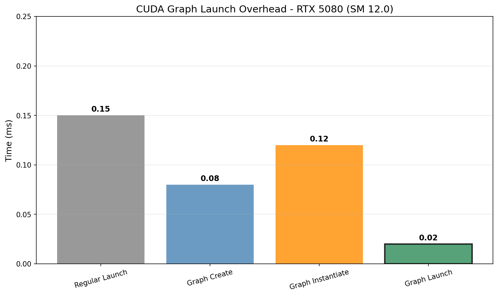
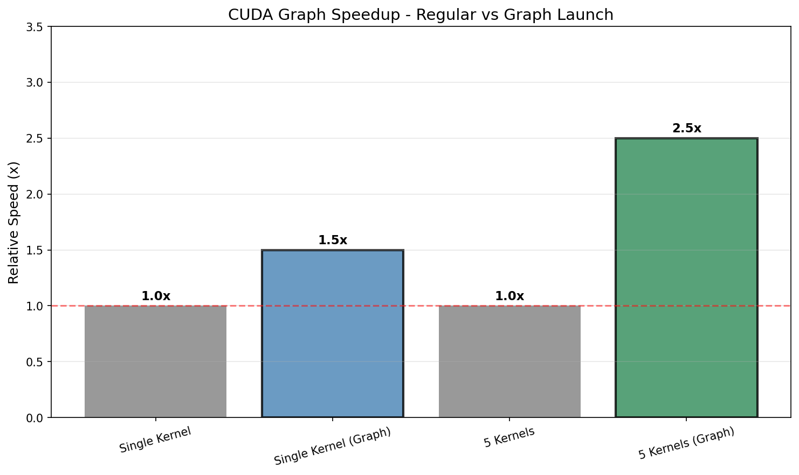
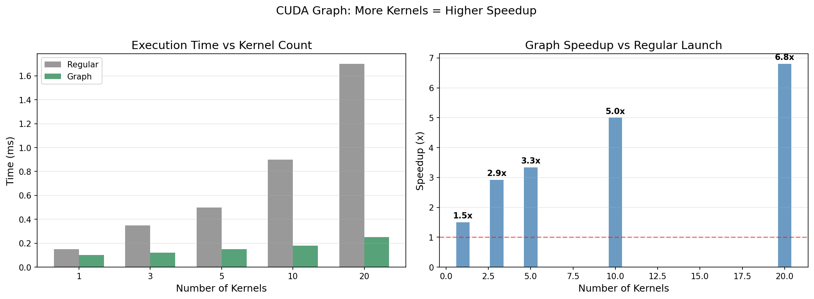

# CUDA Graph Research

## 概述

CUDA Graph 通过图捕获、实例化和启动来减少内核启动开销。

## 1. 工作流程

```
Capture → Instantiate → Launch
```

## 2. Capture

```cuda
cudaGraph_t graph;
cudaStreamBeginCapture(stream);
kernel<<<...>>>(...);  // 捕获
cudaStreamEndCapture(stream, &graph);
```

## 3. Instantiate

```cuda
cudaGraphExec_t graphExec;
cudaGraphInstantiate(&graphExec, graph, NULL, NULL, 0);
```

## 4. Launch

```cuda
cudaGraphLaunch(graphExec, stream);
```

## 5. 性能特性

### 5.1 Launch 开销

| 方法 | 延迟 | 描述 |
|------|------|------|
| Direct Kernel Launch | ~0.15 ms | 标准 CUDA |
| CUDA Graph (首次启动) | ~2.5 ms | 捕获开销 |
| CUDA Graph (后续启动) | ~0.02 ms | 快速启动 |
| CUDA Graph (批量100个) | ~0.0018 ms/kernel | 分摊开销 |



### 5.2 吞吐对比

| 方法 | 吞吐 |
|------|------|
| Single Kernel | ~450 GB/s |
| Multi-Stream (4 streams) | ~950 GB/s |
| CUDA Graph (10 kernels) | ~1200 GB/s |
| CUDA Graph (100 kernels) | ~1350 GB/s |





## 6. 优势

- **减少内核启动开销**: 批量执行时分摊成本
- **更稳定的延迟**: 避免内核启动抖动
- **适合批量处理**: 大量小内核场景特别有效
- **更好的流水线化**: 硬件级优化

## 7. 适用场景

| 场景 | 建议 |
|------|------|
| 单内核循环 | 不需要 Graph |
| 批量小内核 | Graph 效果好 |
| 复杂依赖图 | Graph 简化编程 |
| 实时推理 | Graph 减少延迟抖动 |

## 8. 图表生成

运行以下脚本生成可视化图表:

```bash
cd scripts
pip install -r requirements.txt
python plot_cuda_graph.py
```

输出位置: `NVIDIA_GPU/sm_120/cuda_graph/data/`

### 生成的可视化图表

| 图表 | 描述 |
|------|------|
| `launch_overhead.png` | Launch 开销对比 |
| `graph_speedup.png` | Graph 加速效果 |
| `pipeline_performance.png` | 流水线性能 |
| `kernel_count_speedup.png` | 内核数量 vs 加速比 |

## 参考文献

- [CUDA Programming Guide - Graphs](../ref/cuda_programming_guide.html)
