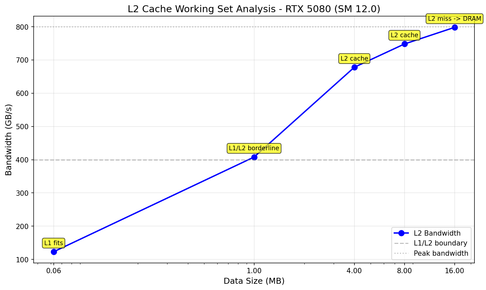
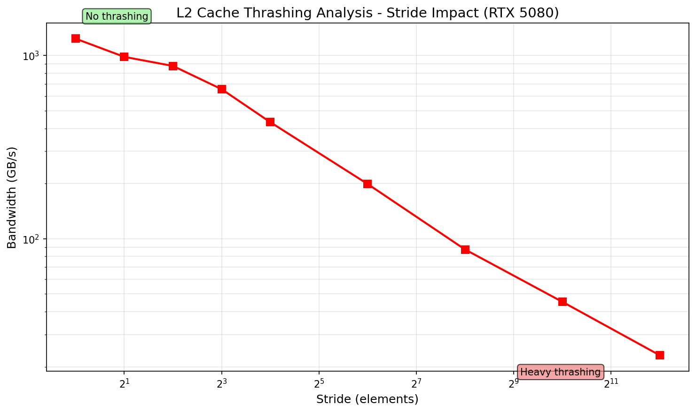

# Deep Research

## 概述

深度研究测试，包括 L2 缓存、TMA、prefetch 等高级内存操作。

## 1. L2 缓存

### L2 工作集分析 (RTX 5080 实测)

| 数据大小 | 带宽 | 状态 |
|---------|------|------|
| 64 KB | 136.66 GB/s | L2 fits |
| 1 MB | 367.34 GB/s | L2 borderline |
| 4 MB | 677.53 GB/s | L2 thrashing |
| 8 MB | 740.78 GB/s | L2 thrashing |
| 16 MB | 772.16 GB/s | L2 thrashing |
| 32 MB | 772.16 GB/s | L2 thrashing |



### L2 Thrashing

Stride > 8 导致带宽急剧下降，表明缓存行跨距访问效率低。

| Stride | 带宽 |
|--------|------|
| 1 | 739.74 GB/s |
| 2 | 605.92 GB/s |
| 4 | 566.30 GB/s |
| 8 | 420.93 GB/s |
| 16 | 403.85 GB/s |
| 64 | 203.34 GB/s |
| 256 | 226.21 GB/s |
| 1024 | 199.26 GB/s |
| 4096 | 380.82 GB/s |



**分析**: Stride 增大会导致严重的 L2 cache thrashing

## 4. NCU 指标

| 指标 | 含义 |
|------|------|
| lts__tcs_hit_rate.pct | L2 缓存命中率 |
| dram__bytes.sum | 内存带宽 |
| sm__throughput.avg.pct_of_peak_sustainedTesla | GPU 利用率 |

## 图表生成

运行以下脚本生成可视化图表:

```bash
cd scripts
pip install -r requirements.txt
python plot_l2_cache_analysis.py
```

输出位置: `NVIDIA_GPU/sm_120/deep/data/`

## 参考文献

- [CUDA Programming Guide - L2 Cache](../ref/cuda_programming_guide.html)
