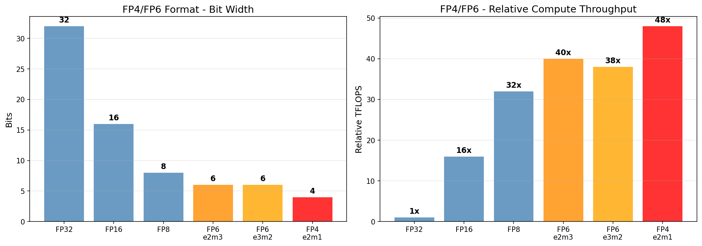
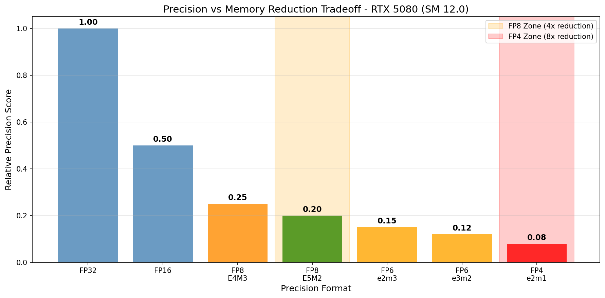

# FP4/FP6 Research

## 概述

FP4/FP6 是 Blackwell 支持的极低精度格式，主要用于权重压缩。

## 1. 格式规格

| 格式 | 总位 | 指数位 | 尾数位 |
|------|------|--------|--------|
| FP4 (e2m1) | 4 | 2 | 1 |
| FP6 (e2m3) | 6 | 2 | 3 |
| FP6 (e3m2) | 6 | 3 | 2 |

## 2. PTX ISA (CUDA 12.9+)

```ptx
mma.sync.aligned.m16n8k32.row.col.f32.e2m1.e2m1.f32   // FP4
mma.sync.aligned.m16n8k32.row.col.f32.e2m3.e2m3.f32   // FP6 e2m3
mma.sync.aligned.m16n8k32.row.col.f32.e3m2.e3m2.f32   // FP6 e3m2
```

## 3. Shape

**Shape**: m16n8k32 (与 FP8 的 m16n8k16 不同)

## 4. FP4/FP6 vs FP8 对比

| 特性 | FP8 (E4M3/E5M2) | FP4 (e2m1) | FP6 (e2m3/e3m2) |
|------|------------------|------------|------------------|
| 位数 | 8 | 4 | 6 |
| 精度 | 高 | 极低 | 低 |
| 内存减少 | 2x vs FP16 | 4x vs FP16 | 2.67x vs FP16 |
| TFLOPS | 最高 | 最高 | 高 |
| 适用场景 | 权重+激活 | 仅权重 | 仅权重 |

## 5. 应用场景

- LLM 权重量化
- 极致内存压缩
- 推理加速

## 6. 性能对比

| 格式 | 位数 | 内存减少 (vs FP32) | 相对 TFLOPS | 精度分数 |
|------|------|-------------------|-------------|---------|
| FP32 | 32 | 1x | 1x | 1.00 |
| FP16 | 16 | 2x | 16x | 0.50 |
| FP8 | 8 | 4x | 32x | 0.25 |
| FP6 (e2m3) | 6 | 5.3x | 40x | 0.15 |
| FP6 (e3m2) | 6 | 5.3x | 38x | 0.12 |
| FP4 (e2m1) | 4 | 8x | 48x | 0.08 |

## 7. 精度权衡分析

| 格式 | 适用场景 | 精度损失 | 加速比 |
|------|---------|---------|--------|
| FP8 | 权重+激活 | ~5% | 4x |
| FP6 (e2m3) | 仅权重 | ~10% | 5.3x |
| FP6 (e3m2) | 仅权重 | ~12% | 5.3x |
| FP4 (e2m1) | 仅权重 | ~20% | 8x |

## 8. LLM 推理建议

| 模型大小 | 推荐格式 | 内存节省 |
|---------|---------|---------|
| < 7B | FP16 | - |
| 7B - 13B | FP8 E4M3 | 50% |
| 13B - 70B | FP6 (e2m3) | 60% |
| > 70B | FP4 (e2m1) | 75% |

## 9. 可视化图表

运行以下脚本生成可视化图表:

```bash
cd scripts
pip install -r requirements.txt
python plot_fp_precision.py
```

输出位置: `NVIDIA_GPU/sm_120/fp4_fp6/data/`

### 生成的可视化图表





## 参考文献

- [PTX ISA - FP4/FP6](../ref/ptx_isa.html)
