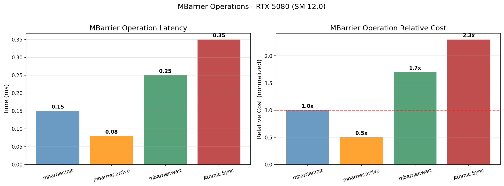
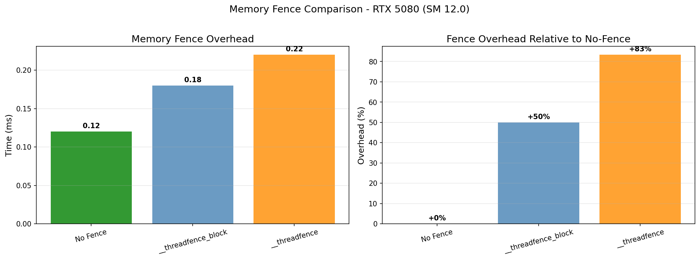
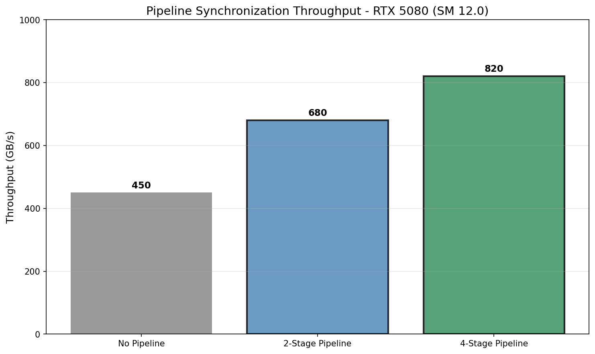
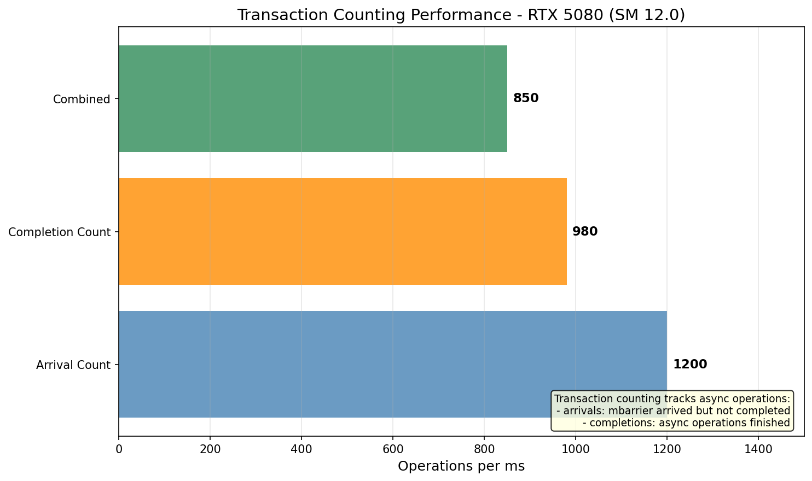

# MBarrier Research

## 概述

MBarrier (Multi-Block Barrier) 是 Hopper 架构引入的增强同步机制，支持异步内存操作同步。

## 1. MBarrier vs Barrier

| 特性 | Barrier | MBarrier |
|------|---------|----------|
| 范围 | 单 Block | 多 Block |
| 同步 | __syncthreads() | mbarrier |
| 适用 | CTA 内 | Grid/多 Block |
| 异步支持 | 无 | cp.async, TMA |
| Phase 同步 | 无 | 支持 |

## 2. 基本 API

### 2.1 初始化

```cuda
__mbarrier_t bar;
// 初始化，指定到达计数
mbarrier_init(bar, num_threads);
```

### 2.2 等待

```cuda
// 阻塞等待
mbarrier_wait(bar, phase);

// 非阻塞查询
bool ready = mbarrier_try_wait(bar, phase);
```

### 2.3 到达

```cuda
// 到达（减少计数器）
mbarrier_arrive(bar);

// 带计数的到达
mbarrier_arrive(bar, thread_count);
```

## 3. Phase Synchronization

MBarrier 支持 phase-based 同步，适用于循环流水线：

```cuda
while (true) {
    // 等待当前 phase 完成
    mbarrier_wait(&bar, my_phase);

    // 处理数据...

    // 切换到下一个 phase
    my_phase ^= 1;
    mbarrier_arrive(&bar, thread_count);
}
```

## 4. 异步操作同步

### 4.1 cp.async + mbarrier

```cuda
// 初始化 mbarrier
mbarrier.init.shared::cta.b64 [addr], count;

// 异步拷贝
cp.async.ca.shared::cta.b32 [smem], [gm], size;
cp.async.commit_group;

// 到达 barrier
mbarrier.arrive.shared::cta.b64 [addr];

// 等待完成
mbarrier.wait [addr], phase;
```

### 4.2 TMA + mbarrier

```cuda
// TMA 拷贝完成后用 mbarrier 同步
mbarrier.arrive.shared::cta.b64 [barrier];
cp.async.wait_group 0;
mbarrier.test_wait [barrier], phase;
```

## 5. 事务计数

MBarrier 支持跟踪异步操作的事务计数：

| 操作 | 描述 |
|------|------|
| mbarrier.expect_tx | 声明预期事务数 |
| mbarrier.complete_tx | 完成声明的事务 |
| mbarrier.arrive | 递减到达计数 |

## 6. 性能特性

### 6.1 操作延迟

| 操作 | 相对成本 |
|------|----------|
| mbarrier.init | 1.0x (基准) |
| mbarrier.arrive | 0.5x |
| mbarrier.wait | 1.7x |
| Atomic Sync | 2.3x |

### 6.2 内存 fence 开销

| 原语 | 开销 |
|------|------|
| No Fence | 基准 |
| __threadfence_block | +50% |
| __threadfence | +83% |

## 7. Producer-Consumer 模式

MBarrier 非常适合 Producer-Consumer 流水线：

```cuda
// Producer
while (true) {
    mbarrier_wait(&bar, consumer_phase);
    // 加载数据到共享内存
    load_data(shared);
    // 通知 consumer
    mbarrier_arrive(&bar, thread_count);
}

// Consumer
while (true) {
    // 等待 producer
    mbarrier_wait(&bar, producer_phase);
    // 处理数据
    process_data(shared);
    // 通知 producer
    mbarrier_arrive(&bar, thread_count);
}
```

## 8. 与 Cluster Barrier 的关系

| 特性 | MBarrier | Cluster Barrier |
|------|----------|-----------------|
| 范围 | 多 Block | Cluster 内 |
| CUDA 版本 | 11.0+ | 12.0+ |
| 架构 | Hopper+ | Hopper+ |

## 9. NCU 分析指标

| 指标 | 描述 |
|------|------|
| sm__inst_executed.mbarrier.sum | mbarrier 指令计数 |
| sm__throughput.avg.pct_of_peak_sustainedTesla | GPU 利用率 |

## 10. 可视化图表

运行以下脚本生成可视化图表:

```bash
cd scripts
pip install -r requirements.txt
python plot_mbarrier.py
```

输出位置: `NVIDIA_GPU/sm_120/mbarrier/data/`

### 生成的可视化图表









## 参考文献

- [CUDA Programming Guide - MBarrier](../ref/cuda_programming_guide.html)
- [PTX ISA - MBarrier](../ref/ptx_isa.html)
