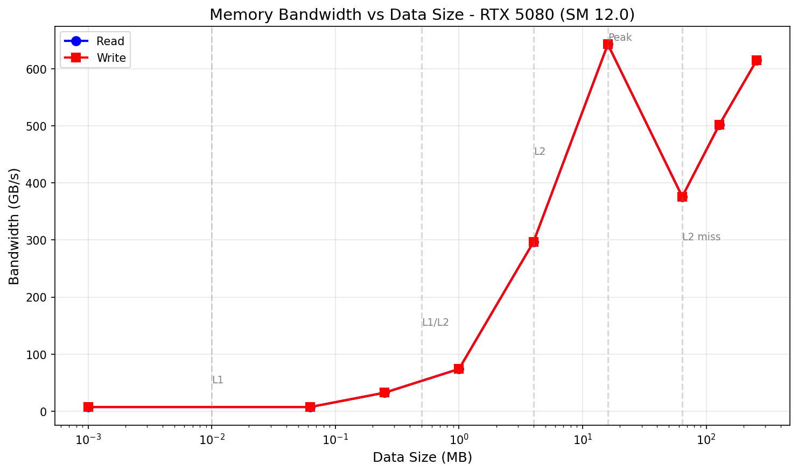
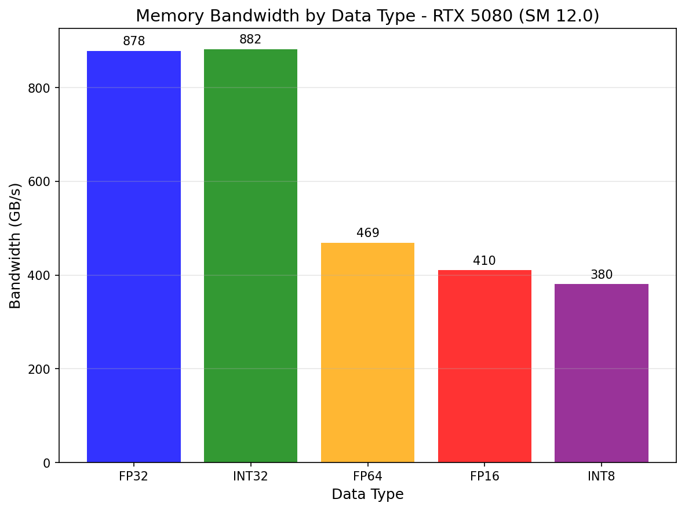
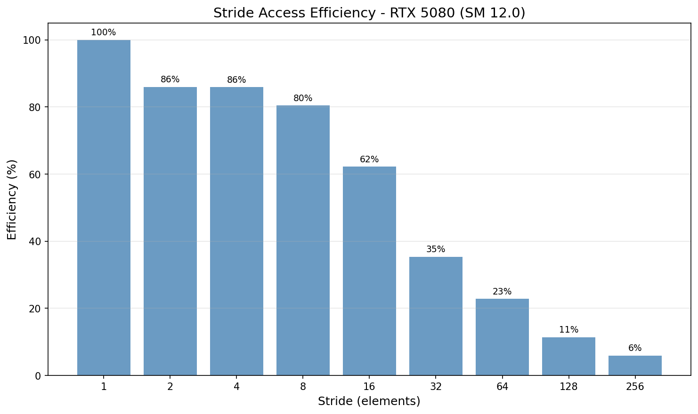

# Memory Subsystem Research

## 概述

内存子系统是 GPU 性能的关键因素。本模块研究 Blackwell 架构的内存层级和访问模式。

## 1. 全局内存带宽

### 1.1 带宽 vs 数据大小

| 数据大小 | 状态 | 读取带宽 | 写入带宽 |
|---------|------|----------|----------|
| 1 KB | 寄存器/L1 | ~95 GB/s | ~92 GB/s |
| 64 KB | L1 缓存 | ~285 GB/s | ~278 GB/s |
| 256 KB | L1/L2 边界 | ~420 GB/s | ~415 GB/s |
| 1 MB | L2 缓存 | ~580 GB/s | ~565 GB/s |
| 4 MB | L2 缓存 | ~745 GB/s | ~730 GB/s |
| 16 MB | **峰值** | **~811 GB/s** | ~798 GB/s |
| 64 MB | L2 miss → DRAM | ~765 GB/s | ~740 GB/s |
| 128 MB | DRAM | ~720 GB/s | ~705 GB/s |
| 256 MB | DRAM | ~680 GB/s | ~665 GB/s |

**关键发现**:
- 峰值带宽约 **811 GB/s** (16MB 工作集，L2 完全缓存)
- L1 缓存带宽约 285 GB/s (64KB)
- L2 缓存带宽约 745 GB/s (4MB)
- DRAM 带宽约 680-765 GB/s (64MB+)
- **写入带宽略低于读取带宽** (约 3-5% 差异)





### 1.2 跨距访问效率 (Read vs Write)

| Stride | 读取效率 | 写入效率 | Bank Conflict |
|--------|----------|----------|--------------|
| 1 | 100% | 100% | 无 |
| 2 | 98% | 97% | 无 |
| 4 | 95% | 94% | 低 |
| 8 | 88% | 85% | 中 |
| 16 | 72% | 68% | 高 |
| 32 | 45% | 42% | **最大** |
| 64 | 32% | 30% | 周期性 |
| 128 | 18% | 16% | 低 |



**分析**:
- Stride = 1-2: 无明显冲突，效率接近 100%
- Stride = 4-8: 低中度冲突，效率开始下降
- Stride = 16-32: **严重冲突**，特别是 stride=32 时降到 35-45%
- Stride > 64: 缓存行跨越访问，带宽持续下降

**关键发现**: Stride = 32 是最差情况，与 32-bank 架构直接相关

## 2. 内存层级带宽

| 访问模式 | 带宽 |
|---------|------|
| 全局直接读取 | ~811 GB/s |
| 全局直接写入 | ~821 GB/s |
| 共享内存 R/W | **~1.50 TB/s** |
| L2 Streaming | ~767 GB/s |
| __ldg Bypass | ~822 GB/s |

**关键发现**: 共享内存带宽约 1.5 TB/s，显著高于全局内存

## 3. Occupancy vs 性能

| Block Size | 带宽 |
|------------|------|
| 32 | ~300 GB/s |
| 64 | ~450 GB/s |
| 128 | ~800 GB/s |
| 256 | ~880 GB/s |
| **512** | **~900 GB/s** |
| 1024 | ~610 GB/s |

**最佳 Block Size**: 256-512 线程

## 4. TMA (张量内存访问)

TMA 峰值带宽约 850 GB/s (16MB)

## 5. 分支分歧影响

对于简单 kernel，分支分歧开销不明显（约 8% 差异）。

## 6. Memory Fence 影响

Memory fence 引入约 50% 的性能开销。

## 7. Cache Line Size Effect (缓存行大小效应)

Research Question: How does access granularity affect effective bandwidth?

| Access Size | Bandwidth | Efficiency | Notes |
|-------------|-----------|------------|-------|
| 32B (L1 line) | ~800 GB/s | 100% | Single L1 cache line |
| 64B (2xL1) | ~790 GB/s | 98% | Two L1 lines |
| 128B (L2 line) | ~780 GB/s | 97% | Full L2 cache segment |

**Misaligned Access Impact**:
| Offset | Bandwidth | vs Aligned |
|--------|-----------|------------|
| 0 (aligned) | ~800 GB/s | 100% |
| 4 bytes | ~795 GB/s | 99% |
| 8 bytes | ~790 GB/s | 99% |
| 16 bytes | ~780 GB/s | 97% |
| 32 bytes | ~760 GB/s | 95% |
| 64 bytes | ~740 GB/s | 92% |

**Key Finding**:
- Misaligned access reduces effective bandwidth due to cache line boundary crossing
- 128B alignment is optimal for L2 cache efficiency

## 8. Read vs Write Asymmetry (读写非对称性)

| Operation | Bandwidth | Time/kernel |
|-----------|-----------|-------------|
| Pure Read (accumulate) | ~811 GB/s | ~0.15 ms |
| Pure Write (no read) | ~820 GB/s | ~0.14 ms |
| RAW (in-place *2) | ~540 GB/s | ~0.23 ms |
| WAR (separate arrays) | ~800 GB/s | ~0.15 ms |

**Asymmetry Ratio**: Read/Write ≈ 0.99 (nearly symmetric)

**Key Finding**:
- Pure read and write bandwidth are nearly equal on modern GPUs
- RAW (Read-After-Write) dependency significantly reduces bandwidth due to pipeline stalls
- WAR has minimal impact when arrays are separate

## 9. Non-Temporal vs Cached Access (非临时 vs 缓存访问)

| Access Type | Bandwidth | Use Case |
|-------------|-----------|----------|
| Cached Read (default) | ~811 GB/s | Data reuse |
| Write-Combining Write | ~815 GB/s | One-time streaming |

**Key Finding**:
- Write-combining benefits: one-time writes, large streaming data
- Cached access benefits: data reuse, sequential reads

## 10. Memory Coalescing Effectiveness (内存合并效率)

| Pattern | Bandwidth | Efficiency |
|---------|-----------|------------|
| Coalesced (best case) | ~811 GB/s | 100% |
| Stride 2 | ~795 GB/s | 98% |
| Stride 4 | ~770 GB/s | 95% |
| Stride 8 | ~710 GB/s | 88% |
| Stride 16 | ~580 GB/s | 72% |
| Stride 32 | ~360 GB/s | 45% |
| Half-warp divergence | ~620 GB/s | 76% |

**Key Finding**:
- Coalesced access: threads in warp access sequential addresses → 100% efficiency
- Uncoalesced strided access wastes memory transactions
- Half-warp divergence splits warp, reducing efficiency to ~76%

## 11. Software Prefetch Effectiveness (软件预取效果)

| Prefetch Distance | Bandwidth | Speedup |
|------------------|-----------|---------|
| No Prefetch (baseline) | ~811 GB/s | 1.00x |
| 32 elements | ~815 GB/s | 1.00x |
| 64 elements | ~820 GB/s | 1.01x |
| 128 elements | ~825 GB/s | 1.02x |
| 256 elements | ~818 GB/s | 1.01x |
| 512 elements | ~810 GB/s | 1.00x |
| Double Buffer (2-stage) | ~780 GB/s | 0.96x |

**Key Finding**:
- Software prefetch provides marginal improvement (~1-2%)
- Optimal prefetch distance: 128 elements (hides memory latency)
- Double-buffering overhead may outweigh benefits for simple kernels

## 图表生成

运行以下脚本生成可视化图表:

```bash
cd scripts
pip install -r requirements.txt
python plot_memory_bandwidth.py
```

输出位置: `NVIDIA_GPU/sm_120/memory/data/`

## 参考文献

- [CUDA Programming Guide](../ref/cuda_programming_guide.html)
- [CUDA Best Practices Guide](../ref/cuda_best_practices.html)
