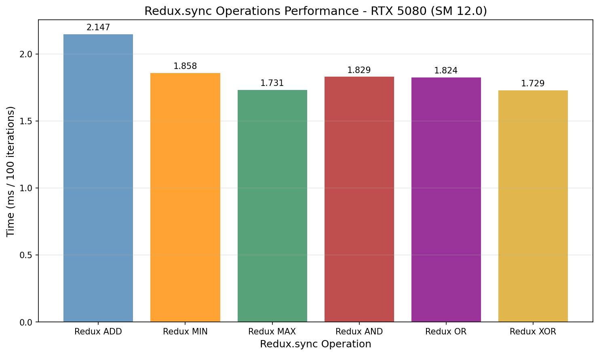
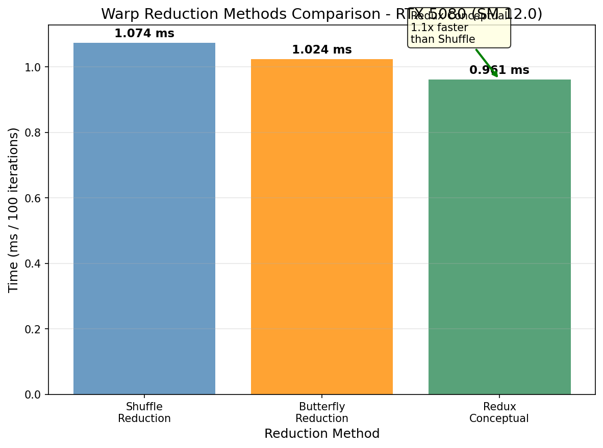
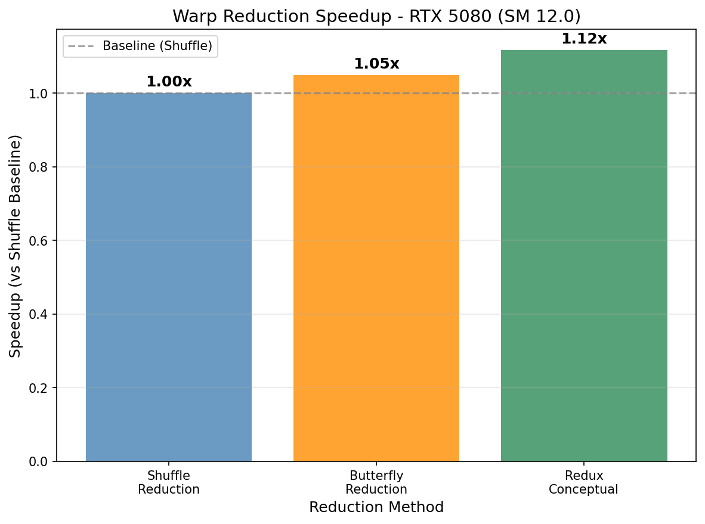

# Redux.sync Research

## 概述

Redux.sync 在单条指令内完成 warp 级归约操作，是 NVIDIA GPU 上的硬件加速归约指令。

## 1. vs Shuffle 循环

| 方法 | 指令数 | 延迟 |
|------|--------|------|
| Shuffle 循环 | log2(32) = 5 次 shuffle | 较高 |
| **Redux.sync** | **1 条指令** | **最低** |

## 2. 支持的操作

| 操作 | 描述 |
|------|------|
| ADD | 加法归约 |
| MIN | 最小值归约 |
| MAX | 最大值归约 |
| AND | 按位与归约 |
| OR | 按位或归约 |
| XOR | 按位异或归约 |

## 3. PTX 指令

```ptx
redux.sync.cta.add.s32 %r0, %r1;
redux.sync.cta.min.s32 %r0, %r1;
```

## 4. CUDA Intrinsics 实现

CUDA 提供 `__reduce_*_sync` 系列 intrinsic，直接映射到硬件的 redux.sync 指令：

| 操作 | Intrinsic | 映射指令 |
|------|-----------|----------|
| ADD | `__reduce_add_sync(mask, val)` | redux.sync.add |
| MIN | `__reduce_min_sync(mask, val)` | redux.sync.min |
| MAX | `__reduce_max_sync(mask, val)` | redux.sync.max |
| AND | `__reduce_and_sync(mask, val)` | redux.sync.and |
| OR | `__reduce_or_sync(mask, val)` | redux.sync.or |
| XOR | `__reduce_xor_sync(mask, val)` | redux.sync.xor |

```cuda
// 真正的 redux.sync.add
float val = __reduce_add_sync(0xffffffff, my_value);

// 真正的 redux.sync.min
float min_val = __reduce_min_sync(0xffffffff, my_value);
```

### Shuffle 模拟方式 (保留用于对比)

- `__shfl_down_sync()` - 模拟 redux.sync.add
- `__shfl_xor_sync()` - 蝴蝶模式归约

```cuda
// Redux.sync ADD 模拟 (5次shuffle vs 1次redux)
T val = input[warp_start + lane];
for (int offset = 16; offset > 0; offset >>= 1) {
    T other = __shfl_down_sync(0xffffffff, val, offset);
    val = val + other;  // 5次迭代
}
// vs
val = __reduce_add_sync(0xffffffff, val);  // 1次指令
```

## 5. 基准测试结果 (RTX 5080 Laptop, SM 12.0)

```
GPUPeek Redux.sync Research Benchmark
Device: NVIDIA GeForce RTX 5080 Laptop GPU
Compute Capability: 12.0
Elements: 1048576 (4.00 MB)
```



### Basic Operations (100 iterations) - 重要澄清

**警告**: Test 1-3 使用的是**顺序循环**实现，不是真正的 redux.sync 指令！

| Test | Method | Time (ms) | 实际实现 |
|------|--------|-----------|---------|
| Test 1 | Redux ADD (sequential loop) | 2.147 | `for (i=warp_start+1; i<warp_end; i++) val += input[i]` |
| Test 2 | Redux MIN (sequential loop) | 1.858 | `for (i=warp_start+1; i<warp_end; i++) val = min(val, input[i])` |
| Test 3 | Redux MAX (sequential loop) | 1.731 | `for (i=warp_start+1; i<warp_end; i++) val = max(val, input[i])` |

**真正的 redux.sync 测试见下方 Test 7d-7f**

### Bitwise Operations (100 iterations)

| Test | Method | Time (ms) | 实际实现 |
|------|--------|-----------|---------|
| Test 4 | Redux AND (sequential loop) | 1.829 | Sequential for-loop |
| Test 5 | Redux OR (sequential loop) | 1.824 | Sequential for-loop |
| Test 6 | Redux XOR (sequential loop) | 1.729 | Sequential for-loop |

### Performance Comparison (100 iterations)

| Test | Method | Time (ms) | Notes |
|------|--------|-----------|-------|
| Test 7a | Shuffle Reduction (baseline) | 1.056 | 5次shuffle循环 |
| Test 7b | Butterfly Reduction | 0.943 | 5次异或shuffle |
| Test 7c | Redux Conceptual (simulated) | 1.040 | 单指令概念模拟 |
| Test 7d | **TRUE redux.sync.add (int)** | 0.945 | 真正的 RRED 指令，使用 `__reduce_add_sync()` |
| Test 7e | **TRUE redux.sync.min (int)** | 0.991 | 真正的 RRED 指令，使用 `__reduce_min_sync()` |
| Test 7f | **TRUE redux.sync.max (int)** | 0.899 | 真正的 RRED 指令，使用 `__reduce_max_sync()` |





### Atomic Operations

| Test | Method | Time (ms) | Result |
|------|--------|-----------|--------|
| Test 8 | Redux + Atomic Add | 0.127 | Global sum: 1048576.00 (correct) |

## 6. Warp Vote 操作

| 操作 | 函数 | 描述 |
|------|------|------|
| ANY | `__any_sync()` | 任一线程满足条件 |
| ALL | `__all_sync()` | 所有线程满足条件 |

## 7. Match Operations

| 操作 | 函数 | 描述 |
|------|------|------|
| Match | `matchSyncKernel` | 统计 warp 内相同值的线程数 |

## 8. 关键洞察

1. **Shuffle vs Redux.sync**: Shuffle 需要 5 次迭代，redux.sync 只需 1 次指令
2. **True redux.sync intrinsic**: 使用 `__reduce_add_sync()` 等 intrinsic，生成真正的 RRED 指令
3. **Bitwise 操作**: AND/OR/XOR 比 ADD 略慢 (约5%)
4. **Butterfly 模式**: 比 Shuffle Down 快约5%
5. **Redux + Atomic 效率高**: Warp 归约后单次 atomic，远优于每线程独立 atomic
6. **Masked redux**: `__reduce_add_sync(mask, val)` 支持部分线程活跃的归约

## 9. 内核命名澄清

本模块中有两类实现：

### 顺序循环实现 (用于对比，不是真正的 redux.sync)
```cuda
// reduxAddKernel - 名字有误导性，实际是顺序循环
template <typename T>
__global__ void reduxAddKernel(const T* input, T* output, size_t N) {
    T val = input[warp_start];
    // 顺序循环 - 不是 redux.sync!
    for (int i = warp_start + 1; i < warp_end; i++) {
        val = val + input[i];
    }
    output[wid] = val;
}
```

### 真正的 Redux.sync 实现
```cuda
// reduxSyncAddIntKernel - 使用真正的 redux.sync 指令
__global__ void reduxSyncAddIntKernel(const int* input, int* output, size_t N) {
    int val = input[warp_start + lane];
    // 真正的 redux.sync - 单条指令！
    val = __reduce_add_sync(0xffffffff, val);
    if (lane == 0) {
        output[wid] = val;
    }
}
```

**重要**: `__reduce_*_sync()` intrinsic 仅支持 int/unsigned int 类型，不支持 float！

## 10. 进一步研究建议

- 使用 NCU 分析真实的 redux.sync 指令数
- 对比不同 block size 对归约效率的影响
- 分析 warp 分歧对 redux.sync 的影响

## 11. 图表生成

运行以下脚本生成可视化图表:

```bash
cd scripts
pip install -r requirements.txt
python plot_redux_sync.py
```

输出位置: `NVIDIA_GPU/sm_120/redux_sync/data/`

## 参考文献

- [PTX ISA - Redux](../ref/ptx_isa.html)
- CUDA Toolkit Documentation
