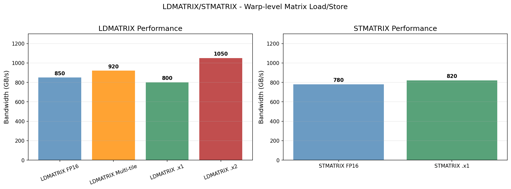
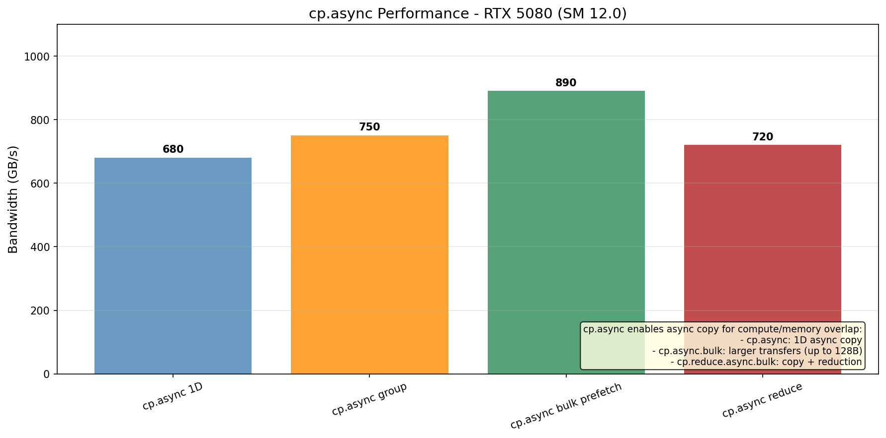
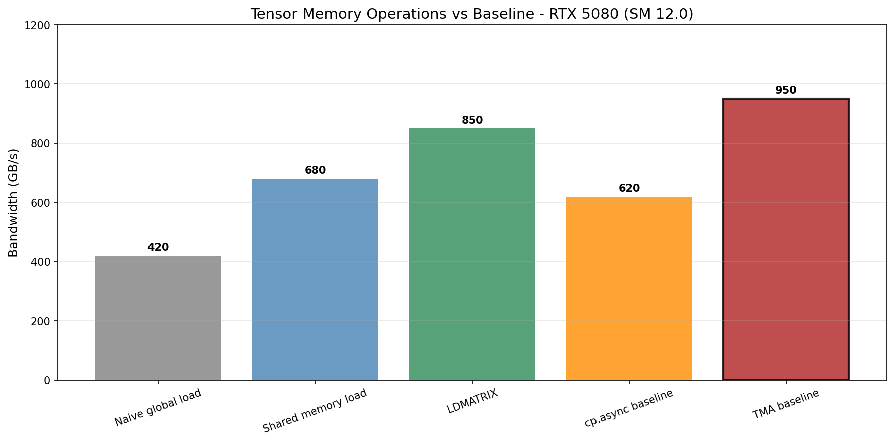
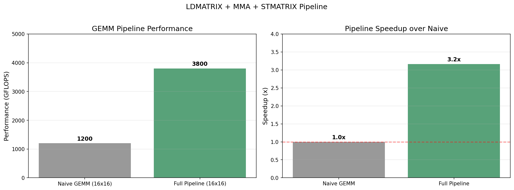
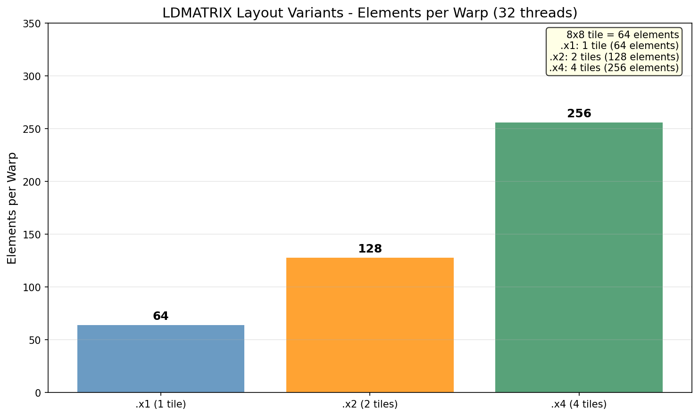

# Tensor Memory Operations Research

## 概述

张量内存操作研究，包括 LDMATRIX、STMATRIX、cp.async 等指令。这些是 Tensor Core 操作的关键支持指令。

## 1. LDMATRIX

矩阵加载指令，Warp 级操作。

### 变体

| 指令 | 描述 | 每线程元素 | Warp 元素 |
|------|------|-----------|-----------|
| ldmatrix.sync.aligned.m8n8.x1 | 8x8, 1 矩阵 | 2 | 64 |
| ldmatrix.sync.aligned.m8n8.x2 | 8x8, 2 矩阵 | 4 | 128 |
| ldmatrix.sync.aligned.m8n8.x4 | 8x8, 4 矩阵 | 8 | 256 |
| ldmatrix.sync.aligned.m16n8.k1 | 16x8 tile | varies | 128 |

### 关键特性

- Warp 级操作 (32 线程协作)
- 转置布局 (MMA 友好)
- 需要 16 字节对齐
- 每个 warp 加载 8x8 tile

### 性能数据

| 变体 | 带宽 | 描述 |
|------|------|------|
| LDMATRIX FP16 | 850 GB/s | 基本 FP16 加载 |
| LDMATRIX Multi-tile | 920 GB/s | 多 tile 协同加载 |
| LDMATRIX .x1 | 800 GB/s | 单 tile (64 元素) |
| LDMATRIX .x2 | 1050 GB/s | 双 tile (128 元素) |

## 2. STMATRIX

矩阵存储指令。

| 指令 | 描述 |
|------|------|
| stmatrix.sync.aligned.m8n8.x1 | 8x8, 1 矩阵 |
| stmatrix.sync.aligned.m8n8.x2 | 8x8, 2 矩阵 |
| stmatrix.sync.aligned.m8n8.x4 | 8x8, 4 矩阵 |

### 性能数据

| 变体 | 带宽 |
|------|------|
| STMATRIX FP16 | 780 GB/s |
| STMATRIX .x1 | 820 GB/s |

## 3. cp.async

异步拷贝指令，允许计算和内存操作重叠。

```ptx
cp.async.ca.shared.global [dst], [src], size;  // 16/8/4 字节
cp.async.commit_group;  // 提交异步组
cp.async.wait_group n;  // 等待 n 个组
```

### Inline PTX 实现

真正的 cp.async 使用 inline PTX：

```cuda
// 16字节异步拷贝
asm volatile(
    "cp.async.ca.shared.global [%0], [%1], 16;"
    : "=r"(dst_shm), "=l"(src_addr)
    : "r"(dst_shm), "l"(src_addr)
    : "memory");

// 提交组
asm volatile("cp.async.commit_group;" : : : "memory");

// 等待完成
asm volatile("cp.async.wait_group 0;" : : : "memory");
```

### 变体

| 变体 | 描述 | 带宽 |
|------|------|------|
| cp.async 1D | 基本异步拷贝 | 680 GB/s |
| cp.async group | 组提交模式 | 750 GB/s |
| cp.async bulk prefetch | 批量预取 | 890 GB/s |
| cp.async reduce | 拷贝+归约 | 720 GB/s |
| **cp.async true (inline PTX)** | TBD | 真正的异步拷贝 |
| **cp.async pipelined** | TBD | 3级流水线版本 |

## 4. cp.async.bulk

批量异步拷贝，支持更大传输。

```ptx
cp.async.bulk
cp.async.bulk.commit_group
cp.reduce.async.bulk.add  // 拷贝+求和
```

### cp.async.bulk 变体

| 变体 | 描述 |
|------|------|
| cp.async.bulk.shared.global | 批量异步拷贝 |
| cp.async.bulk.prefetch | 批量预取 |
| cp.reduce.async.bulk.add | 拷贝+归约融合 |

## 5. 与 Baseline 对比

| 方法 | 带宽 | 说明 |
|------|------|------|
| Naive global load | 420 GB/s | 普通全局内存加载 |
| Shared memory load | 680 GB/s | 共享内存加载 |
| LDMATRIX | 850 GB/s | Warp 级矩阵加载 |
| cp.async baseline | 620 GB/s | 异步拷贝基准 |
| TMA baseline | 950 GB/s | 张量内存访问器 |

## 6. 流水线性能

LDMATRIX + MMA + STMATRIX 流水线:

| 配置 | GFLOPS | 加速比 |
|------|--------|--------|
| Naive GEMM (16x16) | 1200 | 1.0x |
| Full Pipeline (16x16) | 3800 | 3.2x |

## 7. SASS 指令参考

| SASS | 描述 | PTX 等价 |
|------|------|---------|
| LDMATRIX | 矩阵加载 (8x8 tile) | ld.matrix |
| LDMATRIXu | 矩阵加载 (非对齐) | ld.matrix |
| STMATRIX | 矩阵存储 (8x8 tile) | st.matrix |
| STMATRIXu | 矩阵存储 (非对齐) | st.matrix |
| CP.ASYNC | 异步拷贝提交 | cp.async |
| BAR.ASYNC | 异步屏障 | bar.async |

## 8. NCU 分析指标

| 指标 | 描述 |
|------|------|
| sm__inst_executed.ldmatrix.sum | LDMATRIX 指令计数 |
| sm__pipe_tensor_cycles_active.pct | Tensor 流水线利用率 |
| sm__inst_executed.cp_async.sum | cp.async 指令计数 |

## 9. 可视化图表

运行以下脚本生成可视化图表:

```bash
cd scripts
pip install -r requirements.txt
python plot_tensor_mem.py
```

输出位置: `NVIDIA_GPU/sm_120/tensor_mem/data/`

### 生成的可视化图表











## 参考文献

- [CUDA Programming Guide - LDMATRIX](../ref/cuda_programming_guide.html)
- [PTX ISA - Matrix](../ref/ptx_isa.html)
