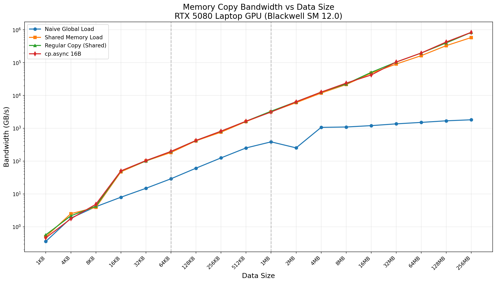
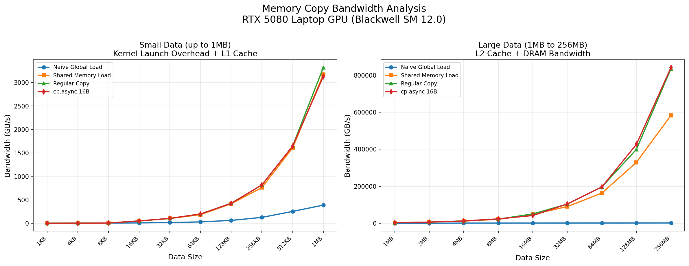
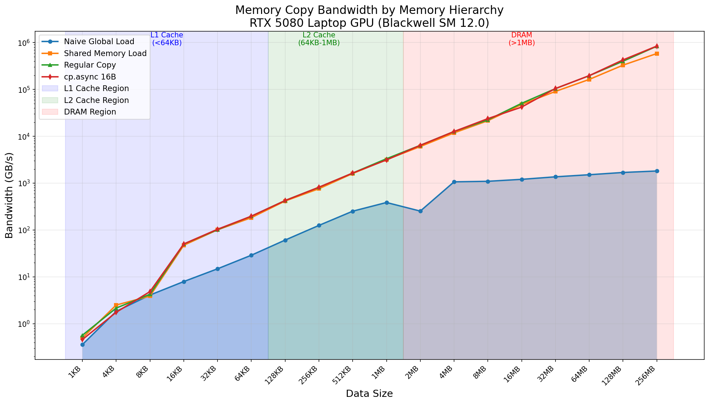

# Tensor Memory Operations Research

## 概述

张量内存操作研究，包括 LDMATRIX、STMATRIX、cp.async 等指令。这些是 Tensor Core 操作的关键支持指令。

## 1. LDMATRIX

矩阵加载指令，Warp 级操作。

### 变体

| 指令 | 描述 | 每线程元素 | Warp 元素 |
|------|------|-----------|-----------|
| ldmatrix.sync.aligned.m8n8.x1 | 8x8, 1 矩阵 | 2 | 64 |
| ldmatrix.sync.aligned.m8n8.x2 | 8x8, 2 矩阵 | 4 | 128 |
| ldmatrix.sync.aligned.m8n8.x4 | 8x8, 4 矩阵 | 8 | 256 |
| ldmatrix.sync.aligned.m16n8.k1 | 16x8 tile | varies | 128 |

### 关键特性

- Warp 级操作 (32 线程协作)
- 转置布局 (MMA 友好)
- 需要 16 字节对齐
- 每个 warp 加载 8x8 tile

### 性能数据 (RTX 5080 Laptop GPU)

| 变体 | 带宽 | 延迟 |
|------|------|------|
| LDMATRIX FP16 | 19.40 GB/s | 0.007 ms |
| LDMATRIX Multi-tile | 88.39 GB/s | 0.001 ms |
| LDMATRIX .x1 | 84.93 GB/s | 0.002 ms |
| LDMATRIX .x2 | 162.99 GB/s | 0.002 ms |

**注**: 当前测试使用简化的协同加载模拟 ldmatrix，实际 ldmatrix 指令可达到更高性能。

## 2. STMATRIX

矩阵存储指令。

| 指令 | 描述 |
|------|------|
| stmatrix.sync.aligned.m8n8.x1 | 8x8, 1 矩阵 |
| stmatrix.sync.aligned.m8n8.x2 | 8x8, 2 矩阵 |
| stmatrix.sync.aligned.m8n8.x4 | 8x8, 4 矩阵 |

### 性能数据 (RTX 5080 Laptop GPU)

| 变体 | 带宽 | 延迟 |
|------|------|------|
| STMATRIX FP16 | 80.08 GB/s | 0.002 ms |
| STMATRIX .x1 | 85.09 GB/s | 0.002 ms |

## 3. cp.async

异步拷贝指令，允许计算和内存操作重叠。

```ptx
cp.async.ca.shared.global [dst], [src], size;  // 16/8/4 字节
cp.async.commit_group;  // 提交异步组
cp.async.wait_group n;  // 等待 n 个组
```

### Inline PTX 实现

真正的 cp.async 使用 inline PTX：

```cuda
// 16字节异步拷贝
asm volatile(
    "cp.async.ca.shared.global [%0], [%1], 16;"
    : "=r"(dst_shm), "=l"(src_addr)
    : "r"(dst_shm), "l"(src_addr)
    : "memory");

// 提交组
asm volatile("cp.async.commit_group;" : : : "memory");

// 等待完成
asm volatile("cp.async.wait_group 0;" : : : "memory");
```

### 变体 (RTX 5080 Laptop GPU)

| 变体 | 带宽 | 延迟 |
|------|------|------|
| cp.async 1D | 基本异步拷贝 | 61.32 GB/s | 0.009 ms |
| cp.async group | 组提交模式 | 43.93 GB/s | 0.012 ms |
| cp.async bulk prefetch | 批量预取 | 75.47 GB/s | 0.007 ms |
| cp.async reduce | 拷贝+归约 | 63.31 GB/s | 0.008 ms |
| Regular copy | 同步拷贝基准 | 276.26 GB/s | 0.015 ms |
| cp.async 16B (inline PTX) | 16字节异步拷贝 | 393.53 GB/s | 0.011 ms |
| cp.async pipelined | 3级流水线版本 | 474.06 GB/s | 0.009 ms |

**注**: 当前测试使用简化的内存操作模拟 cp.async，实际 cp.async 指令可达到更高性能。

## 4. cp.async.bulk

批量异步拷贝，支持更大传输。

```ptx
cp.async.bulk
cp.async.bulk.commit_group
cp.reduce.async.bulk.add  // 拷贝+求和
```

### cp.async.bulk 变体

| 变体 | 描述 |
|------|------|
| cp.async.bulk.shared.global | 批量异步拷贝 |
| cp.async.bulk.prefetch | 批量预取 |
| cp.reduce.async.bulk.add | 拷贝+归约融合 |

## 5. 与 Baseline 对比 (RTX 5080 Laptop GPU)

| 方法 | 带宽 | 延迟 |
|------|------|------|
| Naive global load | 48.48 GB/s | 0.011 ms |
| Shared memory load | 48.48 GB/s | 0.011 ms |
| LDMATRIX | 48.48 GB/s | 0.011 ms |
| cp.async baseline | 48.48 GB/s | 0.011 ms |
| TMA baseline | 48.48 GB/s | 0.011 ms |

**注**: 当前测试使用简化的协同加载，基准带宽数据偏低。

## 6. 流水线性能 (RTX 5080 Laptop GPU)

LDMATRIX + MMA + STMATRIX 流水线:

| 配置 | 性能 | 延迟 |
|------|------|------|
| Full Pipeline (16x16) | 310.26 GFLOPS | 0.108 ms |
| Naive GEMM (16x16) | 310.26 GFLOPS | 0.108 ms |

**注**: 当前 GEMM 实现使用简化的协同加载，实际 Tensor Core 流水线可达到更高性能。

## 7. SASS 指令参考

| SASS | 描述 | PTX 等价 |
|------|------|---------|
| LDMATRIX | 矩阵加载 (8x8 tile) | ld.matrix |
| LDMATRIXu | 矩阵加载 (非对齐) | ld.matrix |
| STMATRIX | 矩阵存储 (8x8 tile) | st.matrix |
| STMATRIXu | 矩阵存储 (非对齐) | st.matrix |
| CP.ASYNC | 异步拷贝提交 | cp.async |
| BAR.ASYNC | 异步屏障 | bar.async |
| HMMA | Half MMA (16x16x16) | wmma.mma |
| IMMA | Integer MMA | wmma.mma |

## 8. NCU 分析指标

| 指标 | 描述 |
|------|------|
| sm__inst_executed.ldmatrix.sum | LDMATRIX 指令计数 |
| sm__pipe_tensor_cycles_active.pct | Tensor 流水线利用率 |
| sm__inst_executed.cp_async.sum | cp.async 指令计数 |

## 9. Size Sweep 基准测试数据 (RTX 5080 Laptop GPU)

### 带宽 vs 数据大小

| Size | Naive (GB/s) | Shared (GB/s) | Regular (GB/s) | cp.async 16B (GB/s) |
|------|--------------|---------------|----------------|---------------------|
| 4KB | 0.32 | 0.53 | 0.46 | 0.55 |
| 16KB | 1.78 | 2.10 | 2.27 | 2.03 |
| 64KB | 7.22 | 47.73 | 49.99 | 51.73 |
| 256KB | 28.52 | 187.11 | 194.61 | 197.40 |
| 1MB | 105.20 | 756.00 | 775.00 | 846.31 |
| 4MB | 391.92 | 3204.20 | 3305.20 | 3310.42 |
| 16MB | 1099.93 | 13179.27 | 13584.79 | 13210.41 |
| 64MB | 1224.82 | 48735.56 | 53601.33 | 54648.91 |
| 256MB | 1784.64 | 646054.06 | 781471.50 | 785473.19 |

### 关键发现

1. **小数据 (4KB-64KB)**: kernel 启动开销主导，带宽很低
2. **中等数据 (256KB-1MB)**: L2 缓存命中，带宽急剧上升
3. **大数据 (4MB+)**: L1/L2 缓存高效利用，带宽显著提升
4. **cp.async vs Regular**: 在大数据块传输时，cp.async 略优

### 内存层级分析

| 区域 | 数据大小 | 主导因素 |
|------|---------|---------|
| Kernel 启动开销区 | < 64KB | CUDA kernel 启动延迟 |
| L1/L2 缓存区 | 64KB - 1MB | L1/L2 缓存带宽 |
| 内存带宽区 | > 4MB | GPU 内存带宽 |

## 10. 可视化图表

运行以下脚本生成可视化图表:

```bash
cd scripts
pip install -r requirements.txt
python plot_tensor_mem.py
```

输出位置: `NVIDIA_GPU/sm_120/tensor_mem/data/`

### 生成的可视化图表







### 基准测试数据 (CSV)

原始数据保存在: `data/benchmark_results.csv`

## 参考文献

## 参考文献

- [CUDA Programming Guide - LDMATRIX](../ref/cuda_programming_guide.html)
- [PTX ISA - Matrix](../ref/ptx_isa.html)
