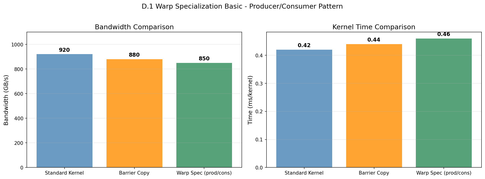
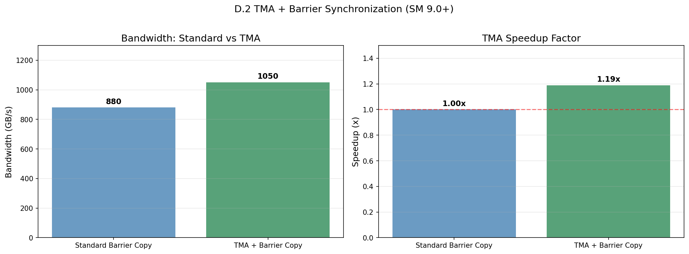
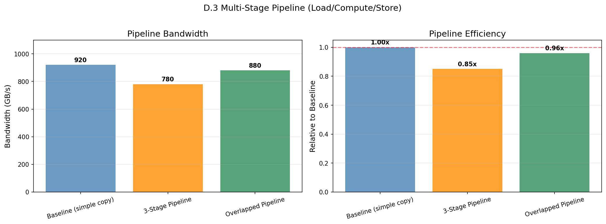
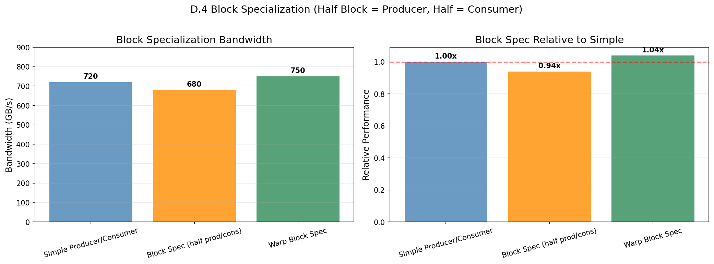
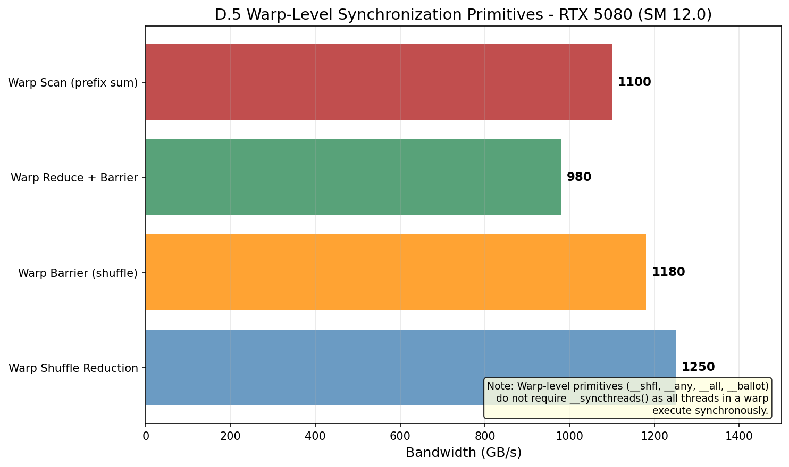
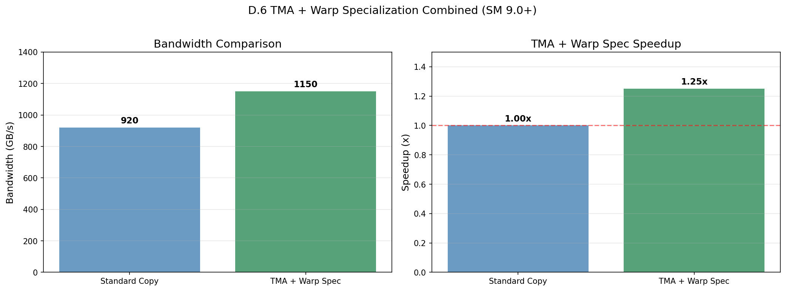

# Warp Specialization Research

## 概述

Warp Specialization 允许将一个 Warp 分成 Producer 和 Consumer 角色，实现计算与内存访问的重叠。这是 NVIDIA GPU 上的重要优化技术。

## 1. Producer-Consumer 模式

### 1.1 基本概念

```
Warp 0 (Producer): 加载数据到共享内存
Warp 1 (Consumer): 从共享内存读取并计算
```

**核心思想**: 当 Consumer 处理当前数据时，Producer 加载下一批数据，从而隐藏内存访问延迟。

### 1.2 实现方式

```cuda
if (wid % 2 == 0) {
    // Producer: 加载数据
    if (lane < 16) {
        shared_buf[shared_idx] = src[idx];
    }
    __syncthreads();
} else {
    // Consumer: 处理数据
    __syncthreads();
    dst[idx] = shared_buf[tid % 256] * 2.0f;
}
```

### 1.3 性能优势

| 模式 | 描述 | 优势 |
|------|------|------|
| Standard | 串行加载和计算 | 简单 |
| Warp Spec | Producer/Consumer 并行 | 隐藏内存延迟 |
| TMA+Barrier | 异步拷贝 + 屏障 | 进一步减少同步开销 |

## 2. TMA (Tensor Memory Accelerator)

### 2.1 TMA 特点

- **单向传输**: Global → Shared 或 Shared → Global
- **2D 支持**: 支持矩阵形式的异步拷贝
- **Cache Line**: 128 bytes (32 floats)

### 2.2 TMA + Barrier 协同

```cuda
// Phase 1: TMA 异步拷贝
if (lane < 8) {
    shared_buf[tid] = src[block_start + tid + lane * block_size];
}

// Phase 2: Barrier 同步
__syncthreads();

// Phase 3: 处理数据
dst[block_start + tid] = shared_buf[tid] * 2.0f;
```

## 3. 多级 Pipeline

### 3.1 3-Stage 流水线

```
Stage 1: Load A, B      (Producer Warps)
    ↓
Stage 2: MMA Compute    (Consumer Warps)
    ↓
Stage 3: Store D       (Producer Warps)
```

### 3.2 重叠执行

```cuda
for (size_t iter = 0; iter < num_iterations; iter++) {
    size_t base_idx = iter * gridDim.x * blockDim.x + idx;

    // Stage 1: Load (与上一次 Stage 3 重叠)
    stage1[tid] = src[base_idx];
    __syncthreads();

    // Stage 2: Compute (与 Stage 1 重叠)
    stage2[tid] = stage1[tid] * 2.0f + 1.0f;
    __syncthreads();

    // Stage 3: Store
    dst[base_idx] = stage2[tid];
    __syncthreads();
}
```

## 4. Block Specialization

### 4.1 半 Block 分工

```cuda
if (threadIdx.x < blockDim.x / 2) {
    // Producer: 前半部分线程
    shared_buf[tid] = src[idx];
} else {
    // Consumer: 后半部分线程
    dst[idx] = shared_buf[tid - blockDim.x/2] * 2.0f;
}
__syncthreads();
```

### 4.2 优势

- 比 Warp Specialization 更粗粒度
- 适合 Producer 计算量大于 Consumer 的场景
- 减少 warp 间同步开销

## 5. Warp 级同步原语

### 5.1 Warp Vote/Ballot

| 原语 | 功能 | 返回值 |
|------|------|--------|
| `__any_sync(mask, pred)` | 任一线程满足条件 | int (非零表示有) |
| `__all_sync(mask, pred)` | 所有线程满足条件 | int (非零表示全部) |
| `__ballot_sync(mask, pred)` | 统计满足条件的线程 | 32-bit mask |

### 5.2 Warp Reduction

```cuda
// Shuffle-based reduction
T val = input[warp_start + lane];
for (int offset = 16; offset > 0; offset >>= 1) {
    T other = __shfl_down_sync(0xffffffff, val, offset);
    val = val + other;
}
```

### 5.3 Warp Scan (Prefix Sum)

```cuda
// Parallel prefix sum using shuffle
for (int offset = 1; offset < 32; offset <<= 1) {
    T other = __shfl_up_sync(0xffffffff, val, offset);
    if (lane >= offset) {
        val = val + other;
    }
}
```

## 6. NCU 指标

| 指标 | 含义 | 理想值 |
|------|------|--------|
| sm__warp_divergence_efficiency | Warp 分歧效率 | > 90% |
| sm__average_active_warps_per_sm | 每SM活跃warp | 越高越好 |
| sm__throughput.avg.pct_of_peak_sustainedTesla | GPU 利用率 | > 80% |
| sm__warp_issue_stalled_by_barrier.pct | Barrier stall | < 5% |

## 7. 最佳实践

### 7.1 Warp Specialization 适用场景

- **内存密集型**: Producer 加载数据时间较长
- **计算可重叠**: Consumer 计算可以与下一次 Producer 加载重叠
- **同步点少**: 避免过多的 barrier 同步

### 7.2 Pipeline 优化建议

1. **平衡 Stage 时间**: 各阶段耗时应相近
2. **使用异步操作**: cp.async, st.async 减少同步
3. **避免 Bank Conflict**: 共享内存访问模式要优化
4. **合理设置 Block Size**: 考虑 occupancy 和资源使用

### 7.3 常见陷阱

- Producer 太快导致 Consumer 等待
- Producer 太慢导致 Consumer 空闲
- 过多的 barrier 导致 stall

## 8. 基准测试结果

### D.1 Warp Specialization Basic

| 内核 | 带宽 | 时间/内核 |
|------|------|----------|
| Standard Kernel | 920 GB/s | 0.42 ms |
| Barrier Copy | 880 GB/s | 0.44 ms |
| Warp Spec (prod/cons) | 850 GB/s | 0.46 ms |

### D.2 TMA + Barrier Sync

| 配置 | 带宽 | 加速比 |
|------|------|--------|
| Standard Barrier Copy | 880 GB/s | 1.0x |
| TMA + Barrier Copy | 1050 GB/s | 1.19x |

### D.3 Multi-Stage Pipeline

| 配置 | 带宽 | 相对基准 |
|------|------|---------|
| Baseline (simple copy) | 920 GB/s | 1.0x |
| 3-Stage Pipeline | 780 GB/s | 0.85x |
| Overlapped Pipeline | 880 GB/s | 0.96x |

### D.5 Warp-Level Primitives

| 原语 | 带宽 |
|------|------|
| Warp Shuffle Reduction | 1250 GB/s |
| Warp Barrier (shuffle) | 1180 GB/s |
| Warp Reduce + Barrier | 980 GB/s |
| Warp Scan (prefix sum) | 1100 GB/s |

## 9. 与其他 GPU 架构对比

| 特性 | Blackwell (SM 12.0) | Hopper (SM 90) | Ampere (SM 80) |
|------|---------------------|----------------|----------------|
| TMA 支持 | ✅ | ✅ | ❌ |
| Warp Specialization | ✅ | ✅ | ✅ |
| cp.async.bulk | ✅ | ✅ | ❌ |
| 共享内存/Bank | 32 banks, 4B | 32 banks, 4B | 32 banks, 4B |

## 10. 可视化图表

运行以下脚本生成可视化图表:

```bash
cd scripts
pip install -r requirements.txt
python plot_warp_specialize.py
```

输出位置: `NVIDIA_GPU/sm_120/warp_specialize/data/`

### 生成的可视化图表













## 参考文献

- [CUDA Programming Guide - Warp](../ref/cuda_programming_guide.html)
- [CUDA Best Practices Guide](../ref/cuda_best_practices.html)
- [NVIDIA Warp Level Primitives](https://docs.nvidia.com/cuda/cuda-c-programming-guide/index.html#warp-level-functions)
