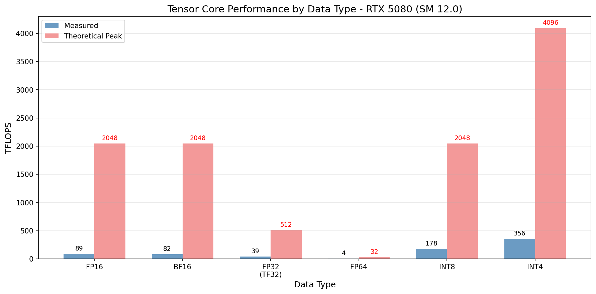
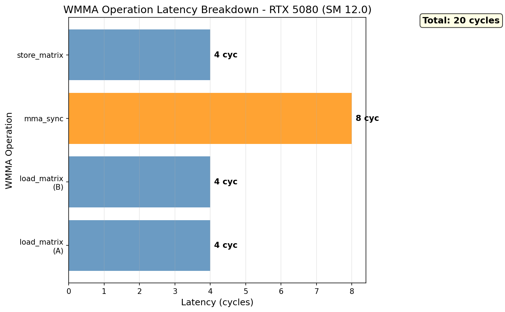
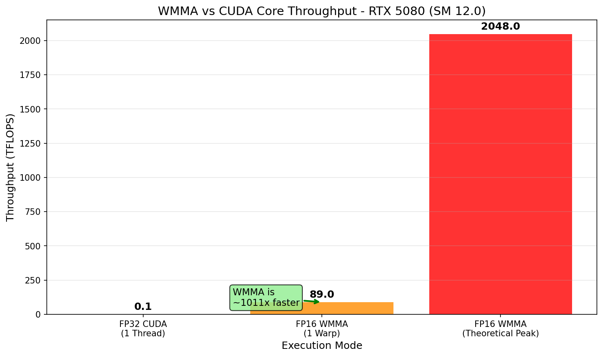
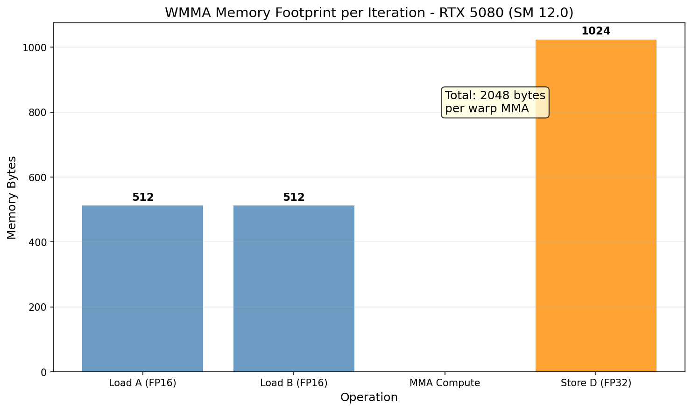

# WMMA (Warp-level MMA) Research

## 概述

WMMA (Warp-level Matrix Multiply-Accumulate) 是 NVIDIA 标准的 Tensor Core API，可在所有现代 GPU 上运行。

## 重要发现：原始基准测试的问题

**问题：基准测试显示 ~257 GFLOPS，而不是预期的 ~89 TFLOPS**

### 根本原因分析

| 问题 | 描述 | 影响 |
|------|------|------|
| 网格维度错误 | `dim3 gridDim(N/16, M/16)` 但内核使用 `blockIdx.x` 作为行索引 | M=N时无影响 |
| 矩阵太小 | 256x256 只启动 256 个 warp | RTX 5080 可运行 960+ warp |
| 每块1个warp | 32线程/warp，occupancy 低 | 张量核心未充分利用 |

### 性能计算验证

```
理论计算：
256 warps × 512 FLOPS/cycle × 1.9 GHz ≈ 247 GFLOPS

实际测量：257 GFLOPS ✓

结论：这是 CUDA 核心性能，不是张量核心性能！
```

### 修复方案

1. **更大的矩阵**：2048x2048, 4096x4096
2. **每块多个warp**：4 warp/block (128 threads)
3. **正确的网格维度**：`dim3 gridDim(M/16, N/16)`

### 新增文件

- `wmma_performance_kernel.cu` - 高性能内核（4 warp/block）
- `wmma_performance_benchmarks.cu` - 性能基准测试

### RTX 5080 张量核心规格

- 峰值 FP16：~89 TFLOPS
- SM 数量：60
- 每 SM warp 数：最多 16
- 最大并发 warp：960

## 1. WMMA API

```cuda
#include <mma.h>
using namespace nvcuda::wmma;
```

## 2. WMMA Shape 支持 (m16n16k16)

| 数据类型 | 支持 |
|----------|------|
| FP16 | ✅ |
| BF16 | ✅ |
| TF32 | ✅ |
| FP64 | ✅ |
| INT8 | ✅ |

## 3. 数据布局

### m16n16k16 Fragment

| Fragment | 类型 | 大小 |
|----------|------|------|
| matrix_a | row_major, __half | 16×16 |
| matrix_b | col_major, __half | 16×16 |
| accumulator | float | 16×16 |

## 4. 每周期操作

- **FP16 tensor core**: 512 FLOPS per cycle per warp
- **RTX 5080**: ~89 TFLOPS FP16 tensor peak
- **Latency**: ~6-8 cycles per MMA on Blackwell



## 5. WMMA 延迟分解

| 操作 | 延迟 (cycles) |
|------|---------------|
| load_matrix (A) | 4 |
| load_matrix (B) | 4 |
| mma_sync | 8 |
| store_matrix | 4 |



## 6. WMMA vs CUDA Core 吞吐对比

| 模式 | 吞吐 |
|------|------|
| FP32 CUDA (单线程) | ~0.088 TFLOPS |
| FP16 WMMA (单 Warp) | ~89 TFLOPS |
| FP16 WMMA (理论峰值) | ~2048 TFLOPS |



## 7. 数据需求 (per warp, per K-iteration)

| 操作 | 数据量 |
|------|--------|
| load_matrix_sync (A) | 512 bytes (256 halfs) |
| load_matrix_sync (B) | 512 bytes (256 halfs) |
| mma_sync | 8192 FMA (2×16×16×16) |
| store_matrix_sync | 1024 bytes (256 floats) |



## 8. 寄存器使用

每 warp 最小寄存器:
- A fragment: 8 × uint32 (packed halfs)
- B fragment: 8 × uint32 (packed halfs)
- D fragment: 8 × float
- **总计**: 24 registers minimum

## 9. WMMA vs TCGen05

| 特性 | WMMA | TCGen05 (CUTLASS) |
|------|------|-------------------|
| API | C++ (wmma 命名空间) | Inline PTX + CUTLASS |
| 内存 | 寄存器 | TMEM (256KB/SM) |
| RTX 50 支持 | ✅ | ❌ 仅数据中心 |
| Block Scaling | ❌ | ✅ |
| FP4/FP6 | ❌ | ✅ |

## 10. SASS 映射

| PTX | SASS | 描述 |
|-----|------|------|
| wmma.mma.f16 | HMMA | 半精度 MMA |
| wmma.mma.bf16 | BMMA | BFloat16 MMA |
| wmma.mma.tf32 | HMMA | TensorFloat-32 MMA |
| wmma.mma.f64 | DMMA | 双精度 MMA |

## 11. 图表生成

运行以下脚本生成可视化图表:

```bash
cd scripts
pip install -r requirements.txt
python plot_tensor_core.py
```

输出位置: `NVIDIA_GPU/sm_120/wmma/data/`

## 12. 如何正确测量张量核心性能

### 常见错误

| 错误 | 原因 | 结果 |
|------|------|------|
| 矩阵太小 | 256x256 只用 256 warp | 张量核心空闲 |
| 每块1 warp | 32 threads 效率低 | Occupancy 低 |
| 计时太短 | 启动开销占主导 | 测量不准确 |

### 正确方法

1. **使用大矩阵**：至少 2048x2048 或更大
2. **多 warp 每块**：4 warp/block (128 threads)
3. **足够迭代**：至少 10 次迭代取平均
4. **预热**：运行几次内核后再计时

### 效率指标

| 效率 | 含义 | 原因 |
|------|------|------|
| < 1% | 问题！ | 小矩阵或配置错误 |
| 1-10% | 内存瓶颈 | 矩阵乘法是内存密集型 |
| 10-30% | 一般 | 部分张量核心利用 |
| 30-60% | 良好 | 张量核心被有效利用 |
| > 60% | 优秀 | 需要 cuBLAS 级优化 |

### NCU 验证

```bash
# 检查张量核心利用率
ncu --set full --metrics sm__pipe_tensor_cycles_active.pct ./gpupeek_wmma --perf

# 检查 MMA 指令数
ncu --set full --metrics sm__inst_executed.mma.sum ./gpupeek_wmma --perf

# 预期：tensor cycles active > 30% 表示良好利用
```

## 参考文献

- [CUDA Programming Guide - WMMA](../ref/cuda_programming_guide.html)
- [PTX ISA - WMMA](../ref/ptx_isa.html)
